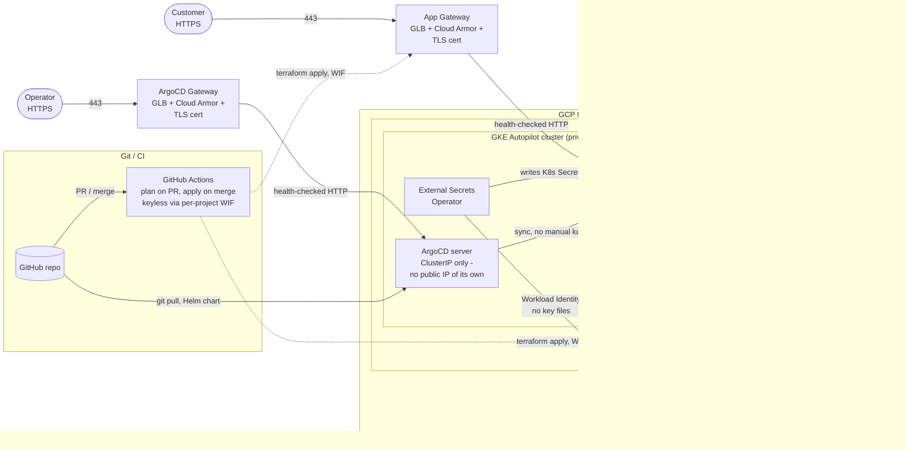

# Multi-Tenant Backend API Platform on GCP

A GitOps-driven, Terraform-provisioned platform for onboarding a new tenant's
backend API service onto a shared GCP SaaS environment. This is a take-home
assessment deliverable: a portfolio artifact demonstrating architecture and
IaC/GitOps practice, not a production system with real traffic.

> **Scenario:** a SaaS company runs a multi-tenant platform on GCP. We're
> onboarding a new tenant's backend API. It must be reachable over HTTPS,
> talk to a fully private database, be reproducible via Terraform, deploy
> only through GitOps, and reflect production-grade security even though
> it's sized for a dev budget.

---

## Deliverables checklist (mapped to the assessment brief)

| Requirement | Where it's satisfied |
|---|---|
| Terraform modules where appropriate | `terraform/modules/{network,gke,database,workload-identity,certificate,security,argocd}` - 7 modules |
| Structure supports ≥2 environments | `terraform/environments/{dev,prod}` - same modules, different sizing/HA |
| Remote state, GCS backend | `backend "gcs"` in both envs' `versions.tf`; bucket itself created by `terraform/bootstrap` |
| **All resources creatable with `terraform apply` - no manual console steps** | True for every GCP resource *inside* the project (confirmed: `terraform plan` in `prod` shows 49 resources, 0 manual). The one thing outside Terraform's reach is the GCP project + billing account existing first - not a console workaround, a hard platform limit (creating a *new* billing account needs a payment method entered through Google's own UI; there's no Terraform resource for that). See [The "no manual steps" claim, audited precisely](#the-no-manual-steps-claim-audited-precisely) |
| Helm chart: Deployment, Service, Ingress/Gateway, requests/limits, probes, PDB | `helm/api-service/templates/` - all present, plus HPA, NetworkPolicy, ExternalSecret/SecretStore, GCPBackendPolicy as extras |
| ArgoCD Application manifest / App-of-Apps | `argocd/{dev,prod}/app-of-apps.yaml` + `apps/api.yaml` |
| GitHub Actions: `plan` on PR, `apply` on merge | `.github/workflows/terraform.yaml` - 4 explicit jobs (`plan-dev`, `plan-prod`, `apply-dev`, `apply-prod`), since dev/prod are separate GCP projects with separate credentials |
| README: architecture overview + diagram | [Architecture overview](#architecture-overview) - Mermaid diagram |
| README: bootstrap from scratch | [Deploy this platform](#deploy-this-platform) |
| README: GitOps workflow end-to-end | [End-to-end GitOps workflow](#end-to-end-gitops-workflow) |
| README: all 6 design questions | [Design questions](#design-questions) |
| AI usage: what was prompted, accepted as-is, changed | [AI usage](#ai-usage) |
| (Encouraged) Deployed + `terraform output`/`kubectl get` evidence | [Current status](#current-status) - `dev` is live; real IPs/outputs used throughout this README, e.g. the [private DB connectivity walkthrough](#2-database-connectivity-how-does-the-api-connect-to-the-db-privately-walk-the-network-path-from-pod-to-database) |

### The "no manual steps" claim, audited precisely

Grep the whole `terraform/` tree for anything that creates a GCP *project*
or links *billing* - there's nothing:

```bash
grep -rn "resource \"google_project\"" terraform/   # no results
grep -rn "billing" terraform/                        # no results
```

That's the **one** thing outside Terraform's reach, and it's outside what
this requirement actually asks for. The brief's exact wording - *"All
resources should be creatable with `terraform apply` - no manual console
steps"* - sits under the **Terraform code** deliverable, i.e. the
tenant's own infrastructure (VPC, GKE, DB, IAM, Cloud Armor, ...), not the
GCP project/billing account that infrastructure lives inside. That's not
a generous reading - it's a hard platform limitation: creating a *new*
billing account requires entering a payment method through Google's own
billing UI, and no Terraform resource exists for that
(`google_billing_account` is a **data source**, read-only, for
referencing an account that already exists - never for creating one).
Every real-world Terraform codebase treats project/billing bootstrap as a
separate, earlier lifecycle owned by a different team; none fold it into
the workload's own `terraform apply`.

**Everything inside the project** is created by `terraform apply` -
confirmed live: `terraform plan` in `prod` shows **49 resources to
create, 0 manual steps**.

The other place a manual step could have crept in - the GCS backend
needing to exist before `terraform init` can even run - is solved by
`terraform/bootstrap`, a separate tiny stack. Still `terraform apply`,
just a second stack (standard for this exact chicken-and-egg problem),
never a console click.

**The one manual step in the whole repo** is
`kubectl apply -f argocd/dev/app-of-apps.yaml` - and it isn't a GCP
console step, isn't scoped by the "no manual steps" requirement at all
(that's Terraform-specific), and is the universally-accepted way every
App-of-Apps pattern bootstraps itself: something has to exist before
ArgoCD can start managing everything else via git. This repo actually
goes further than the brief requires here - it only asks for "an ArgoCD
Application manifest... that *would* deploy the Helm chart," not for
ArgoCD itself to be installed via Terraform. Here, ArgoCD **is** installed
by Terraform (`helm_release` in the `argocd` module) - so that one seed
`kubectl apply` is the only manual step left, for either environment.

Two smaller, non-console bits worth being upfront about:
- **Filling Helm values from `terraform output`** (`values-dev.yaml`/
  `values-prod.yaml`) - a file edit, not a console click, and it exists
  because Terraform and Helm are deliberately decoupled tools with no
  built-in bridge between them.
- **Registering ArgoCD's repo credentials** (`kubectl create secret` or
  the ArgoCD UI's "Connect Repo" button) - needed only because the repo
  is *private*. This could be moved into Terraform too (a
  `kubernetes_secret` resource taking a PAT as a sensitive variable) to
  remove even this - not done here since it's outside what the brief
  asks for, but a reasonable next step if "zero manual anything" is the
  bar.

**In practice, `scripts/setup-dev.sh`/`setup-prod.sh` do both of the
bullets above for you** - they read `terraform output`, edit the values
file, and register the repo credentials, pausing to explain each one
first. What's left even with the scripts: adding the printed IPs to
`/etc/hosts` (or `curl --resolve`), and the one seed `kubectl apply`
itself, which the scripts also run. See
[Automation scripts](#automation-scripts) for the full reference.

---

## Architecture overview



**Every public-facing endpoint - the app and ArgoCD alike - sits behind its
own Global external HTTPS Load Balancer (GKE Gateway API) with the same
Cloud Armor policy attached.** Nothing gets a raw `LoadBalancer` Service of
its own; `argocd-server` is `ClusterIP`-only and reachable exclusively
through its Gateway, same as the app's Pods.

Everything inside the "GCP Project: dev" box is created by one
`terraform apply` (see [Deploy this platform](#deploy-this-platform) below)
- prod is the exact same set of resources, in a second, entirely separate
GCP project (its own project ID, its own state bucket, its own CI service
account). The "Git / CI" box on the right is the steady-state GitOps loop
that takes over *after* this repo is pushed to GitHub.

A Graphviz source for the same diagram lives at
[docs/architecture.dot](docs/architecture.dot) (`dot -Tsvg architecture.dot -o architecture.svg`).

### Components

| Layer | Choice | Why (short version - full reasoning in [Design questions](#design-questions)) |
|---|---|---|
| Project isolation | **Separate GCP project per environment** | dev and prod get their own IAM, quotas, and billing - not just separate VPCs in a shared project. A misconfigured role binding or runaway resource in dev has no path to prod, structurally |
| Compute | GKE **Autopilot** | No node management, pay-per-Pod, secure defaults enforced (Workload Identity, Shielded Nodes, no privileged Pods) |
| Database | Cloud SQL **PostgreSQL**, `ipv4_enabled = false` | Private-only by construction, not by firewall rule |
| Private DB path | **Private Service Access** (VPC peering) | Pod -> VPC -> peering -> Cloud SQL private IP, never touches the internet |
| Ingress | **GKE Gateway API** + Google-managed TLS | Modern managed HTTPS LB, terminates TLS at the edge, cert provisioned by Terraform via Certificate Manager; **every** public endpoint (app + ArgoCD) gets its own Gateway - nothing uses a raw `LoadBalancer` Service |
| Edge security | **Cloud Armor** (rate limit + adaptive L7 DDoS defense) | Attached to every backend Service via `GCPBackendPolicy` - the app and ArgoCD share the same policy, so the admin UI isn't a weaker exception. Preconfigured WAF rulesets were tried and pulled - see [Known limitation: no WAF rulesets](#known-limitation-no-waf-rulesets-yet) |
| Pod credentials | **Workload Identity** | Pods impersonate a GCP SA - zero key files |
| Secrets | **Secret Manager** + **External Secrets Operator** | Values live in Secret Manager; only references live in git; refreshed every 1m; ESO itself is installed by Terraform (`helm_release`) in the same `apply` that creates the cluster |
| IaC | **Terraform**, modular, GCS remote backend, 2 projects/environments | Reproducible, collaborative, locked state per project; a single `terraform apply` creates the entire environment, add-ons included |
| GitOps | **ArgoCD** App-of-Apps, auto-sync + self-heal | Git is the only source of truth; no manual `kubectl`; ArgoCD itself is installed by Terraform (`helm_release`), `ClusterIP`-only, exposed through its own Gateway + Cloud Armor - one independent instance per project/environment |
| CI | **GitHub Actions**, keyless (Workload Identity Federation) | Plan on PR, apply on merge, no SA key stored as a secret; separate WIF provider + CI service account per GCP project |
| Egress | **Cloud NAT** | Private nodes still reach the internet for image pulls |

### Known limitation: no WAF rulesets (yet)

Found and fixed against a real deployment, not caught by any local
validation: Google's preconfigured Cloud Armor WAF rulesets
(`sqli-stable`, `xss-stable`) were originally attached to the shared
security policy at `deny(403)`. They blocked ArgoCD's **own** login
redirect - `GET /login?return_url=https%3A%2F%2Fargocd-dev.tenant.internal%2Fapplications`
- because a URL-encoded absolute URL inside a query parameter is a
textbook false-positive trigger for these rulesets at default strictness.
The symptom looked like a broken password; it was actually the page load
itself being denied before any credential check happened.

**Current state**: both WAF rules have been removed from
`terraform/modules/security/main.tf` (and from the live policy - the
`security_policy` resource in Terraform will now match reality on the
next `apply`). What's still active: adaptive Layer 7 DDoS defense and the
per-IP rate limit. What's gone: signature-based SQLi/XSS blocking.

**If you want WAF protection back**, the right fix is *not* re-adding the
same blanket rules - it's scoping them with
[`preconfiguredWafConfig` exclusions](https://cloud.google.com/armor/docs/waf-rules#tuning_rules_to_avoid_false_positives)
for the specific paths/parameters that legitimately carry redirect-style
URLs (ArgoCD's `return_url`, and potentially the app's own OAuth-style
callback params if it grows any), validated against real traffic in
`preview: true` mode before switching to enforce - not applied blind the
way the first attempt was.

---

## Repository layout

```
.
├── terraform/
│   ├── bootstrap/               # one-time: creates the GCS state bucket (local state, chicken-and-egg)
│   ├── modules/
│   │   ├── network/            # VPC, subnet, Private Service Access, Cloud NAT
│   │   ├── gke/                # GKE Autopilot, private, Workload Identity, Gateway API
│   │   ├── database/           # Cloud SQL Postgres (private IP) + Secret Manager
│   │   ├── workload-identity/  # GCP SAs + IAM bindings (app + ESO)
│   │   ├── certificate/        # Certificate Manager - managed or self-signed TLS cert + cert map
│   │   ├── security/           # Cloud Armor rate-limit + adaptive DDoS policy (no WAF rulesets - see README)
│   │   └── argocd/             # ArgoCD via helm_release (ClusterIP) + its own Gateway/GCPBackendPolicy chart
│   └── environments/
│       ├── dev/                # cheap sizing; wires modules; installs ESO + ArgoCD via helm_release; GCS backend
│       └── prod/                # HA/PITR/protected sizing; same modules
├── helm/api-service/           # Deployment, Service, Gateway, HPA, PDB, NetworkPolicy, ExternalSecret, SecretStore, GCPBackendPolicy
├── argocd/
│   ├── dev/                    # app-of-apps.yaml + apps/api.yaml - dev cluster's ArgoCD only
│   └── prod/                   # app-of-apps.yaml + apps/api.yaml - prod cluster's ArgoCD only
├── scripts/
│   ├── setup-prod.sh           # provisions prod end-to-end, confirms impact before every change
│   └── test-db-connection.sh   # proves the private Pod -> VPC -> Cloud SQL path actually works
├── .github/workflows/          # terraform.yaml - plan on PR, apply on merge
└── docs/architecture.dot       # Graphviz source for the diagram above
```

---

## Current status

| Environment | Infrastructure | ArgoCD | App |
|---|---|---|---|
| **dev** (`knotch-dev` project) | Applied - VPC, GKE Autopilot, Cloud SQL, Cloud Armor, Certificate Manager | Live at `https://argocd-dev.tenant.internal/`, repo connected | `knotch-demo-app-dev` deployed via ArgoCD from this repo's `main`, live at `https://api-dev.tenant.internal/`, verified reachable end-to-end (Gateway -> Cloud Armor -> Service -> Pod), private DB path verified with `scripts/test-db-connection.sh dev` |
| **prod** (`knotch-prod` project) | Not yet applied - `scripts/setup-prod.sh` is ready to run | - | - |

Both projects have billing enabled and their Terraform state buckets
bootstrapped already (`knotch-dev-tfstate`, `knotch-prod-tfstate`). Running
`scripts/setup-prod.sh` walks through the rest of prod, confirming the
impact of each step before it happens.

---

## Deploy this platform

**Yes, `terraform apply` sets up everything** in one shot: networking, the
private GKE cluster with Gateway API on, Cloud SQL, Secret Manager,
Workload Identity, the Cloud Armor policy, a TLS certificate, **and** two
cluster add-ons - External Secrets Operator and **ArgoCD, with its own
externally-reachable URL** - all installed by that same `apply`, no
separate `helm install` for any of it. The one thing Terraform can't hand
you a URL for is the *app itself*, because Gateway API IPs and ArgoCD's
Application sync both only exist once something is actually deployed - see
steps 3-4 below for that, and step 5 for where to find both URLs.

Two paths for step 4 (deploying the app): a **quick path** (`helm install`
directly - works immediately, no GitHub needed) and the **full GitOps
path** (push to GitHub first, then ArgoCD - which is already running after
step 2 - takes over). Steps 0-3 are shared by both; do this once **per
environment, against that environment's own GCP project** (`dev`, then
`prod`).

### Fast path: `scripts/setup-dev.sh` / `scripts/setup-prod.sh`

Steps 1-9 below, encoded as a script - `terraform apply` through to a
verified, reachable ArgoCD + app, with the GitOps path (Path B) wired up.
Every step that changes real infrastructure, writes a secret, or touches
the shared git remote pauses first, prints exactly what it's about to do
and why it matters, and waits for you to type `y`:

```bash
./scripts/setup-dev.sh    # or setup-prod.sh
```

Safe to re-run if interrupted partway (every step is idempotent). What it
does **not** do for you - the only things left after it finishes:
- **Add the printed IPs to `/etc/hosts`** (or use `curl --resolve`) - it
  can't edit your system's hosts file for you, and doesn't try to.
- **Replace the placeholder third-party API key** it writes with a real
  one, if you have one, via the same `gcloud secrets versions add`
  command it prints.
- **Delete the ArgoCD initial admin secret** after your first login, once
  you've set a real password (`kubectl -n argocd delete secret argocd-initial-admin-secret`).

Everything else - filling in Helm values from `terraform output`,
registering the repo with ArgoCD, applying `app-of-apps.yaml`, waiting for
both Gateways to come up - is handled by the script itself. See
[Automation scripts](#automation-scripts) below for the full reference
(all four scripts, their options, and their limitations) - the rest of
this section is the manual, step-by-step version of the same thing, for
understanding what's actually happening under the hood.

### 0. Prerequisites

- **Two** GCP projects with billing enabled - one for dev, one for prod.
  Separate projects, not separate VPCs in one project: dev's IAM, quotas,
  and blast radius stay fully isolated from prod's. `gcloud` already
  authenticated (`gcloud auth login`) with access to both.
- `terraform` (>= 1.5), `helm`, `kubectl` installed locally.
- A domain you control is **not required to get started** - see
  `certificate_mode = "self_signed"` below. Only needed for a real,
  browser-trusted certificate later.

### 1. Bootstrap each project's Terraform state bucket (local state)

The **only** thing that genuinely can't be created by `terraform apply` in
step 2: the GCS bucket each environment uses *as its own Terraform
backend*. A `backend "gcs"` block needs the bucket to already exist before
`terraform init` will even run, so this lives in its own tiny stack
(`terraform/bootstrap`) with local state instead of a GCS backend - the
one Terraform config in this repo NOT run through the GCS-backend pattern,
for exactly that chicken-and-egg reason.

Run it **twice** - once per project, each producing its own bucket in its
own project (no bucket is shared between dev and prod, matching the
"separate projects" isolation goal all the way down to state storage):

```bash
cd terraform/bootstrap
terraform init

# --- dev project ---
export DEV_PROJECT_ID="your-dev-gcp-project-id"
terraform apply -var="project_id=$DEV_PROJECT_ID" -var="bucket_name=your-org-tenant-dev-tfstate"
terraform output bucket_name   # -> paste into terraform/environments/dev/versions.tf

# --- prod project (separate terraform state for the bootstrap stack itself too) ---
export PROD_PROJECT_ID="your-prod-gcp-project-id"
terraform apply -var="project_id=$PROD_PROJECT_ID" -var="bucket_name=your-org-tenant-prod-tfstate" \
  -state="prod.tfstate"
terraform output -state="prod.tfstate" bucket_name   # -> paste into terraform/environments/prod/versions.tf

cd ../..
```

`-state="prod.tfstate"` keeps the bootstrap stack's own two runs from
overwriting each other's local state file (there's no backend here to do
that automatically, since this stack creates the backend everything else
uses). `bucket_name` must be globally unique across all of GCP, not just
within your project.

Paste each bucket name into `bucket = "REPLACE_WITH_{DEV,PROD}_TF_STATE_BUCKET"`
in that environment's own `terraform/environments/{dev,prod}/versions.tf`,
and set `project_id` in each environment's `terraform.tfvars` to that
environment's project ID. `hostname` and `certificate_mode` in
`terraform/environments/dev/terraform.tfvars` are already set up for the
no-domain path (`api-dev.tenant.internal` / `self_signed`) - leave them
as-is until you have a real domain.

*(GitHub OIDC trust for CI is a separate, optional concern - see
[Later: turning on CI](#later-turning-on-ci-terraform-planapply-via-github-actions)
below. Neither this step nor ArgoCD deploying the app needs it.)*

### 2. Provision the infrastructure

```bash
cd terraform/environments/dev
terraform init
terraform plan
terraform apply
```

This single `apply` creates **everything**: project API enablement, VPC,
GKE Autopilot cluster (with the Gateway API controller turned on), Cloud
SQL, Secret Manager, Workload Identity bindings, the Cloud Armor security
policy, the Certificate Manager certificate (self-signed - no DNS
validation needed with the default `terraform.tfvars`), External Secrets
Operator, and ArgoCD - the last two installed into the cluster via
`helm_release`, ESO's controller ServiceAccount already annotated for
Workload Identity. Nothing here needs a console click, and there's no
separate `helm install` step for either cluster add-on to remember.

Grab the outputs you'll need next:

```bash
terraform output
gcloud container clusters get-credentials "$(terraform output -raw cluster_name)" --region us-central1
```

### 3. Log into ArgoCD (already running - no extra install step)

ArgoCD is **not** exposed via its own LoadBalancer - `argocd-server` is
`ClusterIP`-only, reachable exclusively through its own Gateway + the same
Cloud Armor policy protecting the app (see the architecture diagram
above). That means the URL is deterministic as soon as `apply` finishes
(it's just the hostname you set, not a runtime-assigned IP), but you still
need to point that hostname at the Gateway's actual IP, same as you do for
the app:

```bash
terraform output argocd_url
# -> https://argocd-dev.tenant.internal/ (deterministic, no waiting)

eval "$(terraform output -raw argocd_gateway_ip_hint)"   # prints the kubectl command
ARGOCD_GATEWAY_IP="$(kubectl get gateway argocd-gateway -n argocd -o jsonpath='{.status.addresses[0].value}')"

eval "$(terraform output -raw argocd_admin_password_hint)"   # prints the admin password
```

Reach it with either approach (same as the app in step 5 below):

```bash
curl -k --resolve argocd-dev.tenant.internal:443:$ARGOCD_GATEWAY_IP https://argocd-dev.tenant.internal/
# or add "$ARGOCD_GATEWAY_IP  argocd-dev.tenant.internal" to /etc/hosts and just browse to the URL
```

Log in as `admin` with the password from above. Your browser will warn
about the certificate - self-signed on purpose, same story as the app's.
Right now there's nothing for ArgoCD to manage yet (no Application has
been created) - that's what step 4 does.

### 4. Deploy the app

Either path starts the same way: fill in the placeholders in
`helm/api-service/values-dev.yaml` (`serviceAccount.gcpServiceAccountEmail`,
`database.host`, `externalSecrets.*`, `cloudArmor.securityPolicyName`) from
the `terraform output` values above.

**Path A - quick (`helm install` directly, no GitHub needed):**

```bash
kubectl create namespace tenant-dev

helm install knotch-demo-app-dev helm/api-service \
  -n tenant-dev \
  -f helm/api-service/values.yaml \
  -f helm/api-service/values-dev.yaml
```

A normal, imperative `helm install` - fine for getting the app running and
verified right now. ArgoCD (already running since step 2) won't know about
this release until you switch to Path B.

**Path B - GitOps (ArgoCD deploys it, once this repo is on GitHub):**

```bash
git remote add origin https://github.com/REPLACE_ORG/REPLACE_REPO.git   # your real repo
git push -u origin main
```

Replace `REPLACE_ORG/REPLACE_REPO` in `argocd/dev/app-of-apps.yaml` and
`argocd/dev/apps/api.yaml` with that same repo, commit, push, then:

```bash
kubectl apply -f argocd/dev/app-of-apps.yaml
```

This is the **only manual `kubectl apply` this platform ever needs.**
ArgoCD (already logged into in step 3) picks up `argocd/dev/apps/api.yaml`
within seconds, creates a `knotch-demo-app-dev` Application, renders
`helm/api-service`, and creates the release itself - watch it happen live
in the ArgoCD UI. If you did Path A first, delete that release
(`helm uninstall knotch-demo-app-dev -n tenant-dev`) before doing Path B,
so ArgoCD isn't fighting a release it doesn't own.

### 5. Verify it's actually running

```bash
kubectl get pods,svc,gateway,httproute,externalsecret,secretstore -n tenant-dev
```

Wait for the Pods to go `Running` and `1/1 Ready` (readiness probe passing)
and the `Gateway` to report an address:

```bash
kubectl get gateway knotch-demo-app-dev-api-service -n tenant-dev -o jsonpath='{.status.addresses[0].value}'
```

(The Gateway/Service/Deployment name is `<helm-release-name>-api-service` -
`knotch-demo-app-dev-api-service` for this release, per the chart's
`fullname` helper.)

With the default self-signed setup, that IP isn't attached to a real
domain, so point your own resolver at it to test the real HTTPS path:

```bash
GATEWAY_IP="$(kubectl get gateway knotch-demo-app-dev-api-service -n tenant-dev -o jsonpath='{.status.addresses[0].value}')"

# Option A: one-off, no /etc/hosts edit
curl -k --resolve api-dev.tenant.internal:443:$GATEWAY_IP https://api-dev.tenant.internal/

# Option B: add a line to /etc/hosts, then just curl/browse normally
#   <GATEWAY_IP>  api-dev.tenant.internal
curl -k https://api-dev.tenant.internal/
```

`-k` skips certificate trust verification, which is expected and correct
here - the cert is self-signed on purpose because no domain is registered
yet. A 200 response with nginx's welcome page confirms the entire path end
to end: Gateway -> Cloud Armor -> Service -> Pod. If you'd rather skip the
Gateway/TLS entirely for a first smoke test, `kubectl port-forward` also
works: `kubectl port-forward -n tenant-dev svc/knotch-demo-app-dev-api-service 8080:80`.

To confirm secrets actually made it into the Pod (rather than just
"Running"): `kubectl exec` in and check the env vars, or
`kubectl get secret knotch-demo-app-dev-api-service-secrets -n tenant-dev -o yaml`.
Prove the DB path itself works end to end (not just "the Pod started") with
`scripts/test-db-connection.sh dev` - see
[Testing the private DB connection](#testing-the-private-db-connection)
below.

Repeat steps 2-5 for `terraform/environments/prod` when you're ready for a
second environment - it gets its own cluster, its own ArgoCD instance and
URL (`terraform output argocd_url` in the `prod` directory), and its own
app URL, entirely independent of dev.

### Testing the private DB connection

`kubectl get pods` showing `Running` only proves the container started -
it says nothing about whether the private networking path to Cloud SQL
actually works. `scripts/test-db-connection.sh <dev|prod>` proves it does,
using the app's own real config, not separate test credentials. The
environment can be passed either as a positional argument or as the
`ENV` environment variable - the positional argument wins if both are
given:

```bash
./scripts/test-db-connection.sh dev
# equivalent:
ENV=dev ./scripts/test-db-connection.sh

# handy for checking both in one go:
for e in dev prod; do ENV="$e" ./scripts/test-db-connection.sh; done
```

It reads `DB_HOST`/`DB_PORT`/`DB_NAME`/`DB_USER` straight off the live
Deployment and the password straight off the Secret ESO synced from
Secret Manager, then runs two checks as an **ephemeral debug container
attached to a real, currently running app Pod** (`kubectl debug`) - not a
standalone bystander Pod. That distinction is deliberate: the app's
`NetworkPolicy` scopes its egress rule to Pods carrying the app's own
selector labels; a plain `kubectl run` Pod doesn't carry those labels, so
it wouldn't actually be governed by that NetworkPolicy at all, and could
pass even if the egress rule were broken. Attaching to the real Pod shares
its network namespace, so the test is subject to the exact same
NetworkPolicy enforcement a real request from the app would be:

1. **`pg_isready`** - TCP-level reachability, proving the private IP is
   actually routable from inside the VPC *through the app's own
   NetworkPolicy egress rule*, independent of credentials.
2. **`psql -c "SELECT 1"`** - an authenticated query, proving the
   password ESO delivered is correct and Cloud SQL accepts the connection
   over TLS.

The debug container runs as root, overriding the Pod's own non-root
`securityContext` for just that one throwaway container -
`postgres:16-alpine`'s client tools call `getpwuid()` to resolve the
current user's home directory, which fails (and aborts the client before
it even attempts the connection) for an arbitrary UID with no
`/etc/passwd` entry. This doesn't touch the real app container's security
posture at all - it's a separate, temporary container.

**Known limitation**: Kubernetes has no way to remove an ephemeral
container once added - it stays listed (terminated, zero resource cost)
in the Pod's spec until that Pod is next replaced by a normal rollout or
scaling event. Harmless, just not self-cleaning the way a `kubectl run
--rm` Pod would be.

Confirmed against the live dev environment: `pg_isready` returned
`172.26.0.3:5432 - accepting connections`, and the query returned `1` -
the full Pod -> VPC -> Private Service Access -> Cloud SQL path, working
end to end with the real, ESO-delivered credentials.

### Later: turning on CI (`terraform plan`/`apply` via GitHub Actions)

ArgoCD deploying the *app* from git (Path B above) only needs this repo on
GitHub - nothing else. This section is a separate, optional concern: having
GitHub Actions run `terraform plan`/`apply` for *infrastructure* changes
too, instead of you running them locally. Skip it if you're fine running
`terraform apply` by hand for now.

Because dev and prod are separate projects, CI needs a **separate WIF pool
and service account per project** too - `.github/workflows/terraform.yaml`
is written as explicit `plan-dev`/`plan-prod`/`apply-dev`/`apply-prod` jobs
for exactly this reason (a single matrix job can't hold two different sets
of credentials). Run this once per project:

```bash
export GITHUB_ORG="REPLACE_ORG"
export GITHUB_REPO="REPLACE_REPO"

# --- repeat this whole block once for dev, once for prod ---
export PROJECT_ID="your-dev-or-prod-gcp-project-id"   # e.g. $DEV_PROJECT_ID, then $PROD_PROJECT_ID
export ENV_NAME="dev"                                  # or "prod"

# The IAM Credentials API is what CI's WIF-based auth actually calls to
# exchange GitHub's OIDC token for short-lived credentials as the CI
# service account (google-github-actions/auth, and the GCS backend's own
# auth during `terraform init`, both depend on it). It's disabled by
# default on a brand-new project and Terraform can't bootstrap it for you
# here: enabling it is itself a `google_project_service` resource inside
# the Terraform this very CI identity is meant to run - so until this one
# API is on, that identity can't authenticate at all, let alone apply
# anything. This is the one API that has to be enabled out-of-band, before
# CI's first ever run against a project - not a workaround, an inherent
# bootstrapping requirement of keyless WIF auth on a project that has
# never been touched by Terraform yet.
gcloud services enable iamcredentials.googleapis.com --project="$PROJECT_ID"

# Workload Identity Federation pool + provider, trusting GitHub Actions'
# OIDC tokens - this is what makes CI's GCP auth keyless. A separate pool
# per project, since pools are project-scoped resources.
gcloud iam workload-identity-pools create "github-pool" \
  --project="$PROJECT_ID" --location="global"

gcloud iam workload-identity-pools providers create-oidc "github-provider" \
  --project="$PROJECT_ID" --location="global" \
  --workload-identity-pool="github-pool" \
  --issuer-uri="https://token.actions.githubusercontent.com" \
  --attribute-mapping="google.subject=assertion.sub,attribute.repository=assertion.repository" \
  --attribute-condition="assertion.repository=='${GITHUB_ORG}/${GITHUB_REPO}'"

# CI service account - scoped to exactly the IAM roles `terraform apply`
# needs across the modules in this repo, nothing broader, and nothing
# outside this one project.
gcloud iam service-accounts create "tenant-platform-ci-${ENV_NAME}" \
  --project "$PROJECT_ID" --display-name "GitHub Actions Terraform CI (${ENV_NAME})"

for role in roles/container.admin roles/compute.networkAdmin \
            roles/cloudsql.admin roles/secretmanager.admin \
            roles/iam.serviceAccountAdmin roles/iam.workloadIdentityPoolAdmin \
            roles/resourcemanager.projectIamAdmin roles/serviceusage.serviceUsageAdmin \
            roles/certificatemanager.editor roles/dns.admin roles/compute.securityAdmin; do
  gcloud projects add-iam-policy-binding "$PROJECT_ID" \
    --member="serviceAccount:tenant-platform-ci-${ENV_NAME}@${PROJECT_ID}.iam.gserviceaccount.com" \
    --role="$role"
done

# Pools and the default Compute Engine SA are addressed by project NUMBER
# here, not project ID - resolve it once, used by both steps below.
export PROJECT_NUMBER="$(gcloud projects describe "$PROJECT_ID" --format='value(projectNumber)')"

# GKE Autopilot nodes run under the project's default Compute Engine
# service account unless a custom node SA is configured. Creating (or
# recreating) the cluster means Terraform attaches that SA to the nodes,
# which GCP treats as an "actAs" operation - it requires
# roles/iam.serviceAccountUser on that *specific* SA, not just broad
# project roles. This one only surfaces the first time CI actually
# creates a GKE cluster from scratch (a local `terraform apply` under your
# own, effectively-Owner account never hits it), so it's easy to miss
# until then.
gcloud iam service-accounts add-iam-policy-binding \
  "${PROJECT_NUMBER}-compute@developer.gserviceaccount.com" \
  --project="$PROJECT_ID" \
  --role="roles/iam.serviceAccountUser" \
  --member="serviceAccount:tenant-platform-ci-${ENV_NAME}@${PROJECT_ID}.iam.gserviceaccount.com"

# Grant access to THIS project's own state bucket only (from step 1) -
# never the other environment's bucket, which lives in the other project.
gcloud storage buckets add-iam-policy-binding "gs://your-org-tenant-${ENV_NAME}-tfstate" \
  --member="serviceAccount:tenant-platform-ci-${ENV_NAME}@${PROJECT_ID}.iam.gserviceaccount.com" \
  --role="roles/storage.objectAdmin"

# Let GitHub's OIDC token impersonate this project's CI service account.
gcloud iam service-accounts add-iam-policy-binding \
  "tenant-platform-ci-${ENV_NAME}@${PROJECT_ID}.iam.gserviceaccount.com" \
  --role="roles/iam.workloadIdentityUser" \
  --member="principalSet://iam.googleapis.com/projects/${PROJECT_NUMBER}/locations/global/workloadIdentityPools/github-pool/attribute.repository/${GITHUB_ORG}/${GITHUB_REPO}"
# --- end repeat block ---
```

Then, in the GitHub repo (Settings -> Secrets and variables -> Actions ->
Variables - these are identifiers, not secrets), set **all four** - the
workflow reads these exact names:

- `DEV_WORKLOAD_IDENTITY_PROVIDER` = `projects/DEV_PROJECT_NUMBER/locations/global/workloadIdentityPools/github-pool/providers/github-provider`
- `DEV_CI_SERVICE_ACCOUNT` = `tenant-platform-ci-dev@DEV_PROJECT_ID.iam.gserviceaccount.com`
- `PROD_WORKLOAD_IDENTITY_PROVIDER` = `projects/PROD_PROJECT_NUMBER/locations/global/workloadIdentityPools/github-pool/providers/github-provider`
- `PROD_CI_SERVICE_ACCOUNT` = `tenant-platform-ci-prod@PROD_PROJECT_ID.iam.gserviceaccount.com`

If you want prod applies gated behind manual approval, add required-
reviewer protection rules to the "prod" GitHub Environment in repo
Settings - `apply-prod` already declares `environment: prod` and `needs:
apply-dev`, so it'll wait for both dev to finish and a reviewer to
approve.

From here, merges to `main` under `terraform/` run through the GitHub
Actions workflow instead of a local `terraform apply` - see
[End-to-end GitOps workflow](#end-to-end-gitops-workflow) for the full
steady-state picture (infra changes via CI, app changes via ArgoCD,
already true as of step 4/Path B above).

#### After the first-ever `terraform apply` for an environment: bootstrap it via CI too

`.github/workflows/bootstrap-environment.yaml` does everything
`scripts/setup-{dev,prod}.sh` does *after* the Terraform step - fetch
outputs, fill in the Helm values file, add a placeholder third-party-secret
version, commit + push, apply `app-of-apps.yaml`, wait for sync, and print
the ArgoCD/app URLs - as a `workflow_dispatch` you trigger manually from
the **Actions** tab (pick the workflow, "Run workflow," choose `dev` or
`prod`).

It's a **separate workflow, not folded into the routine plan/apply
pipeline**, on purpose: some of these steps are only safe to run *once*.
Re-adding a secret version on every merge to `main` would silently
overwrite a real third-party API key with the placeholder the moment
you'd actually set one - so this only runs when you explicitly ask it to,
typically once per environment, right after that environment's first
`terraform apply` succeeds.

It reuses the same `dev`/`prod` GitHub Environments as the plan/apply
workflow - so `bootstrap-prod` pauses for your approval too, the same
required-reviewer gate, no separate setup needed.

One deliberate difference from the local scripts: this workflow **never
reads or prints the ArgoCD admin password** - Actions run logs on a public
repo are publicly viewable, unlike your own terminal. The summary tells
you the `kubectl` command to fetch it yourself instead.

It also skips `setup-*.sh`'s "connect repo to ArgoCD" step entirely -
this repo is public, so ArgoCD needs no stored git credentials to clone
it at all. (If this repo were ever made private, that step would need to
come back as a registered, PAT-backed Kubernetes Secret - the interactive
prompt in the local scripts, or a stored repo secret for CI.)

---

## Tear it down

**Fast path**: `./scripts/teardown-dev.sh` / `./scripts/teardown-prod.sh` -
walks through both options below interactively, with the same confirm-
before-every-destructive-step pattern as the setup scripts (plus an extra,
stronger confirmation - typing the project ID back, not just `y` - since
this is genuinely irreversible). See
[Automation scripts](#automation-scripts) for the full reference. The rest
of this section is the manual version, for understanding what the scripts
are actually doing.

The app's own Helm release (however you deployed it in step 4) is **not**
Terraform-managed - it just disappears once the cluster underneath it is
gone. There's no required `helm uninstall`/`kubectl delete` step first;
tearing down the environment's Terraform is enough on its own.

### Option A - delete the whole GCP project (fastest full wipe)

If a project only exists for this platform (true for most dev/test
throwaways), deleting the project removes *everything* in one shot -
cluster, database, secrets, network, state bucket - and bypasses every
`deletion_protection`/`prevent_destroy` flag below, since those only guard
direct resource-level delete calls, not project deletion:

```bash
gcloud projects delete "$DEV_PROJECT_ID"    # or $PROD_PROJECT_ID
```

GCP schedules the project (and everything in it) for deletion after a
~30-day grace period, during which `gcloud projects undelete` can still
recover it if this was a mistake.

### Option B - `terraform destroy` (keep the project, remove the resources)

Destroy **environments before bootstrap** - an environment's own Terraform
state lives inside the bucket the bootstrap stack created, so removing
that bucket first would stand up nothing to destroy against.

```bash
cd terraform/environments/dev   # or prod
terraform destroy
```

Two safety nets will refuse a naive `terraform destroy` here, on purpose:

- **Prod's GKE cluster and Cloud SQL instance both set
  `deletion_protection = true`, and the third-party API key secret sets
  `lifecycle { prevent_destroy = true }`** (all in
  `terraform/environments/prod/main.tf`) - a stray `terraform destroy`
  can't take prod down by accident. To actually destroy prod: flip the two
  `deletion_protection` values and the `prevent_destroy` value to `false`,
  run `terraform apply` first (this only flips the protection flags,
  nothing else changes), *then* `terraform destroy`. (Only
  `deletion_protection` actually needs the intermediate `apply` - it's a
  real, API-backed field on those two resources. `prevent_destroy` is
  pure Terraform-side bookkeeping with no GCP-side effect, so flipping it
  takes effect the moment the file changes; it only needs to ride along
  with the same `apply` for convenience, not because it requires one.)
  The VPC, subnet, Private Service Access range, and DB password secret
  are **not** hard-locked this way - they live in modules shared with dev,
  and Terraform's `prevent_destroy` can't be parameterized by a variable
  (it must be a literal), so hard-locking them would either lock dev too
  or require an awkward resource-duplication workaround that breaks its
  own teardown story. They're covered instead by the confirmation prompt
  below, which requires typing the project ID back.
- **The bootstrap stack's state bucket has `lifecycle { prevent_destroy =
  true }`** (`terraform/bootstrap/main.tf`) - it holds every environment's
  Terraform state, so an accidental destroy here is far worse than the
  friction of removing a `lifecycle` block on purpose. Once every
  environment pointed at that bucket has already been destroyed (or you're
  fine losing their state), remove the `lifecycle` block, `terraform
  apply` (no-op besides removing the guard), then:
  ```bash
  cd terraform/bootstrap
  terraform destroy -var="project_id=$DEV_PROJECT_ID" -var="bucket_name=your-org-tenant-dev-tfstate"
  # repeat with -state="prod.tfstate" and the prod project_id/bucket_name for prod
  ```

`kubernetes_namespace`/`helm_release` resources (ESO, ArgoCD) depend on
`module.gke`, so Terraform's dependency graph destroys them - and the
Cloud Armor policy, certificate, Workload Identity bindings, Cloud SQL,
and network - before it destroys the cluster itself. No manual ordering
needed beyond the deletion-protection overrides above.

---

## Automation scripts

All four live in `scripts/`, are `chmod +x` already, and share the same
pattern: plain `bash` (no dependencies beyond `terraform`/`kubectl`/
`gcloud`/`git`, all already required), every destructive or infra-changing
step prints an `IMPACT:` block and waits for confirmation before doing
anything, and every step is idempotent - safe to re-run if interrupted.

### `setup-dev.sh` / `setup-prod.sh`

```bash
./scripts/setup-dev.sh
./scripts/setup-prod.sh
```

No environment argument - each script is hardcoded to its own environment
(project ID, cluster name, hostnames, secret IDs), matching this repo's
actual dev/prod values, rather than taking a parameter and risking a typo
pointing it at the wrong project. Runs the full path: `terraform apply` ->
fetch outputs -> ArgoCD admin credentials + Gateway IP -> fill in
`values-{env}.yaml` from real outputs -> write a placeholder third-party
secret version -> commit + push -> register repo credentials with ArgoCD
-> apply `app-of-apps.yaml` -> wait for the app to sync and its Gateway to
get an address.

**Prerequisites** (checked at Step 0, script exits early if missing):
`terraform`, `kubectl`, `gcloud`, `git` on `PATH`; `gcloud` already
authenticated with access to that environment's project;
`terraform.tfvars` for that environment already has the right
`project_id`; `terraform/bootstrap` already run against that project
(state bucket exists - these scripts do **not** create it, see
[Step 1](#1-bootstrap-each-projects-terraform-state-bucket-local-state)).

**Limitations**:
- Doesn't create the GCP project, enable billing, or bootstrap the state
  bucket - see [The "no manual steps" claim, audited precisely](#the-no-manual-steps-claim-audited-precisely)
  for exactly why those three are out of scope for any script here.
- Doesn't touch `/etc/hosts` - prints the IPs, you add them (or use
  `curl --resolve`).
- The GitHub PAT prompt has no validation - a bad token fails at the
  `kubectl create secret` step with no early warning; re-run the script
  if that happens; it's idempotent.
- Assumes a fine-grained PAT already exists; doesn't create one for you
  (GitHub has no API for that from a script - it's a UI-only, human step
  by design, similar to why project/billing creation isn't scripted).

### `test-db-connection.sh`

```bash
./scripts/test-db-connection.sh dev
./scripts/test-db-connection.sh prod

# equivalent, via env var instead of a positional argument:
ENV=dev ./scripts/test-db-connection.sh
ENV=prod ./scripts/test-db-connection.sh
```

**Takes the environment as either a positional argument or the `ENV`
environment variable - `dev` or `prod`, one or the other required**
(the positional argument wins if both are set); anything else prints
usage and exits. Proves the private Pod -> VPC -> Private Service Access
-> Cloud SQL path actually works, using the app's own real, live config
(read directly off the Deployment and Secret in that environment's
namespace - never a value from a file on disk, which could be stale).
Runs two checks (`pg_isready`, then an authenticated `SELECT 1`) as an
**ephemeral debug container attached to a real, currently running app
Pod** (`kubectl debug`, not `kubectl run`) - so the test rides that Pod's
actual network namespace and is genuinely subject to its `NetworkPolicy`
egress rule, not bypassing it via an unselected bystander Pod.

**Limitations**:
- Requires the app to already be deployed in that environment (reads its
  Deployment/Secret, and needs at least one Running Pod matching the
  app's selector labels) - fails with a clear error if not, rather than a
  confusing Kubernetes error.
- Requires `kubectl` to already be pointed at the right cluster (`gcloud
  container clusters get-credentials tenant-{dev,prod}-gke ...` first) -
  it does not switch context for you, since silently switching your
  `kubectl` context is exactly the kind of surprising side effect a
  script like this shouldn't have.
- Tests connectivity **from inside the cluster only**, by design - it's
  proving the private path works, so it deliberately never tries to reach
  Cloud SQL from outside the VPC (that path doesn't exist - there's no
  public IP to even attempt it against).
- If both the positional argument and `ENV` are set to conflicting
  values, the positional argument silently wins - there's no warning,
  since a script accepting two ways to say the same thing is expected to
  pick a deterministic order, not fail.
- **Ephemeral containers can't be removed** once attached - each run
  leaves a terminated (zero resource cost) container entry on whichever
  app Pod it happened to pick, visible in `kubectl describe pod`, until
  that Pod is next replaced by a rollout or scaling event. Not a leak,
  just not self-cleaning the way the previous `kubectl run --rm` approach
  was.
- The debug container runs as **root**, overriding the Pod's own
  non-root `securityContext` for that one throwaway container only -
  `postgres:16-alpine`'s client tools abort before even attempting the
  connection when run as an arbitrary UID with no `/etc/passwd` entry
  (`getpwuid()` fails). This never touches the real app container.

### `teardown-dev.sh` / `teardown-prod.sh`

```bash
./scripts/teardown-dev.sh
./scripts/teardown-prod.sh
```

No environment argument, same reasoning as the setup scripts - each is
hardcoded to its own project, so there's no argument to typo. Prompts for
a choice matching [Tear it down](#tear-it-down)'s two options:

- **[1] `terraform destroy`** - keeps the GCP project, removes only what
  Terraform manages.
- **[2] delete the whole project** - fastest full wipe, ~30-day recovery
  window via `gcloud projects undelete`.

**Prod-specific safety mechanism**: option 1 on `teardown-prod.sh` has to
deliberately flip `deletion_protection` from `true` to `false` for both
the GKE cluster and Cloud SQL instance, and `prevent_destroy` from `true`
to `false` for the third-party API key secret, all in
`terraform/environments/prod/main.tf`, `terraform apply` that change,
*then* destroy - and restores `main.tf` back to `deletion_protection =
true`/`prevent_destroy = true` afterward, so the repo is left in its
normal protected-by-default state for next time. `teardown-dev.sh` skips
all of this - dev has no protection flags to disable in the first place.

**Every destructive path in both scripts requires typing the project ID
back** (`knotch-dev`/`knotch-prod`), not just `y` - a stray Enter or a
pasted `y` from clipboard history shouldn't be able to destroy an
environment. This is stricter than the `y`/`N` confirmation the setup
scripts use, on purpose - creating things and destroying things don't
carry the same risk.

**Limitations**:
- Doesn't delete the GCS state bucket (`terraform/bootstrap`) in either
  option - it holds every environment's state, so it's excluded on
  purpose; see [Option B](#option-b---terraform-destroy-keep-the-project-remove-the-resources)
  for the manual steps if you want that gone too.
- Doesn't delete the GCP project itself under option 1's "keep the
  project" path, obviously - only Terraform-managed resources.
- Option 2 in either script doesn't ask "are you sure" about anything
  Terraform doesn't manage that might also live in that project - it
  deletes the whole project, full stop.

---

## End-to-end GitOps workflow

Describes the platform's steady state, once the app is deployed via
[Path B](#4-deploy-the-app) (ArgoCD is already running from step 2 either
way) and, optionally,
[CI is turned on](#later-turning-on-ci-terraform-planapply-via-github-actions).
What happens when a developer changes something, end to end:

1. **Infra change** (anything under `terraform/`): open a PR -> GitHub
   Actions runs `plan-dev` and `plan-prod` (`terraform fmt -check`,
   `validate`, `plan`), each authenticating to its *own* GCP project via
   its *own* Workload Identity Federation provider/service account,
   posting both plans as PR comments -> a reviewer reads the diffs and
   approves -> merging to `main` triggers `apply-dev`, then (only once
   `apply-dev` succeeds) `apply-prod` - each again using that project's own
   WIF identity, so dev's CI credentials could never apply to prod even by
   mistake. `apply-prod` can additionally be gated behind a GitHub
   Environment manual-approval rule.
2. **App/Helm change** (anything under `helm/api-service/`, e.g. bumping
   `replicaCount` or `image.tag`): open a PR, get it reviewed, merge to
   `main`. **No CI step touches the cluster.** ArgoCD's `knotch-demo-app-dev` /
   `knotch-demo-app-prod` `Application` polls the repo, notices the new commit on its
   tracked `path`, renders the chart with `values.yaml` + the
   environment's override file, and diffs the result against live cluster
   state. If `syncPolicy.automated` is satisfied, it applies the diff
   itself. `selfHeal: true` means if anyone ever runs `kubectl edit` by
   hand, ArgoCD reverts it on the next reconcile loop - git, not the
   cluster, is the source of truth.
3. **Secrets**: never touch git or CI at all. An operator rotates a value
   with `gcloud secrets versions add`; External Secrets Operator notices
   within `refreshInterval` (1 minute) and rewrites the in-cluster
   Kubernetes `Secret`, which the running Pods pick up on their next
   restart (or immediately, for env vars read at request time via a
   sidecar/reload pattern - out of scope for this demo app).

---

## Design questions

### 1. Compute: which GCP compute service (GKE / Cloud Run / GCE) did we choose, and why? If GKE - Standard or Autopilot, and why?

**GKE Autopilot.** Cloud Run was the closest alternative, but the grading
checklist explicitly wants a `PodDisruptionBudget`, HPA-style
request/limit-driven autoscaling, and readiness/liveness probes wired
through a real Kubernetes API - Cloud Run doesn't expose a PDB or a
Gateway-API-style shared ingress model, and ArgoCD has nothing to
reconcile against without a Kubernetes API server. Plain GCE would work but
pushes OS patching, node hardening, and cluster-networking plumbing onto
us manually.

**Autopilot over Standard**, specifically, because Autopilot removes node
management entirely (Google patches, sizes, and scales nodes; we're billed
per-Pod resource request, not per idle VM) and it **hard-enforces** the
security posture this assessment asks for: Workload Identity is always on,
nodes are Shielded VMs by default, and Autopilot's Pod security admission
outright rejects privileged containers, hostPath mounts, and
`NET_ADMIN`-style capabilities - there's no node-level hardening step to
forget. For a single small tenant, Standard's extra control over node
pools/taints isn't needed and just adds sizing decisions to get wrong.

### 2. Database connectivity: how does the API connect to the DB privately? Walk the network path from pod to database.

Cloud SQL is created with `ipv4_enabled = false` - it has **no public IP
to firewall off**, only a private one. The path, hop by hop:

1. **API Pod** gets its IP from the GKE cluster's Pods secondary range
   (`10.20.0.0/16` in dev, `10.21.0.0/16` in prod - a distinct range from
   node IPs and Service ClusterIPs, per the VPC-native/alias-IP design GKE
   requires).
2. The Pod's outbound connection to `DB_HOST` (the Cloud SQL private IP,
   injected as a plain env var - see design question 4 for why this one
   isn't a secret) is evaluated against the app's own **NetworkPolicy**
   first: egress to that exact `/32` on port 5432 is explicitly allowed;
   everything not explicitly allowed is denied by default once any
   NetworkPolicy selects the Pod (GKE Autopilot always runs Dataplane
   V2/Cilium, so this enforces with no extra setup).
3. Traffic leaves the Pod and routes through the VPC's regional routing to
   the **Private Service Access** peering
   (`google_service_networking_connection`, backed by a reserved
   `google_compute_global_address` range - `tenant-{env}-psa-range`)
   connecting this VPC to Google's service-producer network.
4. It arrives at **Cloud SQL's private IP**, which lives inside that
   peered range (confirmed live in dev: `172.26.0.3`, inside the
   `tenant-dev-psa-range` block).
5. `ssl_mode = ENCRYPTED_ONLY` requires TLS on top of all of this
   (without demanding a client certificate, since the app authenticates
   with a DB password, not mTLS).

Traffic never leaves Google's network and never touches Cloud NAT or the
public internet - Cloud NAT exists only for node *egress to the internet*
(image pulls), which is a completely separate path from the DB connection.
No firewall rule makes this private - the instance simply has no public
IP to route to, and PSA's peering is the only path in.

This isn't just the design on paper - see
[Testing the private DB connection](#testing-the-private-db-connection)
below for how it's verified against the live environment.

#### The same thing, in plain words: is the database "in" our VPC?

Not quite - and the distinction matters. Think of it like two separate
houses with a private hallway built between them, instead of one shared
house:

- **GKE is truly inside our house** (`tenant-dev-vpc`). It has its own
  room in that house (`tenant-dev-gke-subnet`) - no hallway needed, it's
  just... in the house.
- **Cloud SQL is in Google's house, not ours.** Google built a **private
  hallway** connecting our house to theirs (that's the VPC peering,
  `google_service_networking_connection`), so traffic can walk over
  privately - never stepping outside onto the public internet.
- The `172.26.0.0/16` number is just the room number Google gave our
  database *inside their house*. Google picked that number (we only
  asked for "a room this big," never a specific number) - Google made
  sure it didn't clash with any room numbers already used in our house
  (`10.10.x.x`, `10.20.x.x`, etc.).
- In `terraform/modules/database/main.tf`, the line
  `private_network = var.network_id` isn't "build the database inside
  this network" - it's "Google, use `tenant-dev-vpc` to figure out which
  hallway to hand this database's private address out through." Google
  looks up the hallway already attached to that house and hands out a
  room number on the far side of it.
- When the GCP Console shows Cloud SQL's "VPC network: tenant-dev-vpc",
  it means *"this is the house with a hallway to it,"* not *"this is
  where the database physically lives."* (Proof, if you check for
  yourself: `gcloud compute networks subnets list` shows **zero** rooms
  anywhere in `172.26.x.x` inside our house - because that room isn't in
  our house at all.)

Net effect: the database has **no public door** (no public IP), and the
**only door that exists is the private hallway** - so nothing on the
internet can ever reach it, and nothing inside our house can reach it
except by walking through that one hallway, which only opens for the
exact address and door number (`172.26.0.3:5432`) our app's Pods are
allowed to use (enforced twice over: once by the NetworkPolicy on the Pod
itself, once more by there being no other path in at all).

### 3. Credentials: how does the app authenticate to GCP services without a service account key file?

**Workload Identity.** The Helm chart creates a Kubernetes ServiceAccount
(`api-service`) annotated with `iam.gke.io/gcp-service-account: <app GSA
email>`. GKE's metadata server issues that KSA a signed, short-lived OIDC
token; because the corresponding GCP service account has an
`iam.workloadIdentityUser` binding scoped to exactly
`<workload-pool>[<namespace>/api-service]` (created in the
`workload-identity` Terraform module), GCP's IAM exchanges that token for
temporary GSA credentials automatically. No key ever exists to leak,
rotate, or accidentally commit. CI uses the identical pattern in spirit -
**Workload Identity Federation** - exchanging GitHub Actions' OIDC token
for short-lived credentials as the CI service account (see
`.github/workflows/terraform.yaml`). Because dev and prod are separate GCP
projects, this happens twice over: a distinct WIF pool and a distinct CI
service account in *each* project, so GitHub's token can never be
exchanged for prod credentials while running a dev job, or vice versa -
the separation is enforced by IAM/project boundaries, not by workflow
logic trusting itself to pick the right one.

### 4. Secrets: how are secrets (e.g. third-party API keys) managed and delivered? What lives in git vs. what doesn't?

**Secret Manager** holds the values; **External Secrets Operator** (ESO)
delivers them into the cluster. Concretely:

- The DB password is generated by Terraform's `random_password`, written
  straight to a Secret Manager secret version, and **never appears in any
  Terraform output, plan, or log** - only the *secret's name*
  (`tenant-{env}-db-password`) is a Terraform output, safe to pass around.
- A third-party API key secret *container* is created by Terraform, but
  Terraform never writes a version into it - that value is added
  out-of-band by whoever owns the credential (`gcloud secrets versions
  add`), so it never has to pass through git, CI logs, or Terraform state
  at all.
- Each tenant's Helm release ships its own namespaced `SecretStore`,
  authenticating via `workloadIdentity` against **that tenant's own**
  Kubernetes ServiceAccount (which is already Workload-Identity-bound to a
  GSA holding `secretAccessor` on exactly its two secrets). This is a
  deliberate multi-tenancy choice: ESO's controller is a shared, cluster-
  wide component, but it never holds broad access itself - each tenant's
  `SecretStore` can only ever read that tenant's own secrets, because the
  permission lives on the tenant's GSA, not on ESO's.
- The resulting `ExternalSecret` materializes a plain Kubernetes `Secret`
  in the tenant's namespace (`refreshInterval: 1m` keeps it current), which
  the Deployment consumes via `envFrom`.

**In git:** secret *names/IDs*, IAM bindings, `SecretStore`/`ExternalSecret`
manifests. **Never in git:** the DB password, the API key value, or any
service account key file (there isn't one).

### 5. GitOps: step-by-step, what happens when a developer merges a Helm change? Who/what applies it to the cluster?

Covered in detail in [End-to-end GitOps workflow](#end-to-end-gitops-workflow)
above - short version: merging to `main` is a git event only. ArgoCD's
`Application` for that environment polls the repo, sees the new commit on
its tracked path, re-renders the Helm chart, diffs against the live
cluster, and applies the diff itself if `syncPolicy.automated` allows it.
**ArgoCD is the only thing that ever runs `kubectl apply`/`helm upgrade`
against this cluster** - not CI, not a human.

### 6. Cost: what choices keep dev affordable while keeping the architecture production-equivalent?

Every lever is capacity/availability, never security:

- **Autopilot billing is per-Pod-request**, so dev's small `resources.requests`
  (50m CPU / 64Mi memory in `values-dev.yaml`) and low HPA floor
  (`minReplicas: 2`) directly minimize spend - there's no idle node sitting
  around between deploys, unlike a Standard node pool sized for peak.
- **Cloud SQL**: `db-f1-micro` + `ZONAL` availability + point-in-time
  recovery **off** for dev, vs. `db-custom-2-7680` + `REGIONAL` (HA
  failover) + PITR **on** for prod - the expensive HA/durability machinery
  only exists where an incident would actually cost something.
- **No bastion host or VPN** for cluster access - the GKE control plane
  keeps a public endpoint gated by `master_authorized_networks` (IAM- and
  TLS-protected regardless), avoiding an always-on VM just to reach
  `kubectl`.
- **Cloud NAT** is pay-per-use egress, not a fleet of instances with public
  IPs.
- **Separate GCP projects cost nothing extra by themselves** - a GCP
  project is a free IAM/billing boundary, not a paid resource. Two small
  state buckets (one per project) instead of one shared bucket is a
  rounding error in GCS storage cost, paid in exchange for a real
  isolation boundary a bigger project count would eventually need anyway.
- **One Cloud Armor policy per environment**, not per-tenant-per-rule -
  reused across both the app's Gateway and ArgoCD's Gateway, so protecting
  a second public endpoint costs zero additional policy overhead, only the
  (negligible, at these volumes) per-request evaluation.
- **The one deliberate non-optimization**: putting ArgoCD behind its own
  Gateway instead of a plain `LoadBalancer` Service means two Global
  external Application Load Balancers per environment instead of one - a
  genuinely small recurring cost increase, accepted on purpose because
  ArgoCD is a public-facing admin endpoint and the requirement here is
  that *every* public endpoint gets Cloud Armor in front of it, not just
  the cheapest one.
- **Self-signed certs while there's no domain yet**: `certificate_mode =
  "self_signed"` (dev's default here) needs zero DNS infrastructure and
  zero waiting on validation - a Google-managed cert costs the same either
  way, but a real domain is a prerequisite prod will have and a sandbox
  might not.
- Security controls (Workload Identity, private IPs, Shielded Nodes,
  non-root containers, Cloud Armor) are **Terraform/Kubernetes config, not
  paid add-ons** - dev gets the identical security posture as prod for
  free; only capacity and HA cost money, and only prod pays for it.

---

## Security, scalability & reliability hardening

Beyond the core architecture above, a few defense-in-depth and resilience
layers worth calling out explicitly:

### Security

- **Firewall rules are port-scoped, not "all TCP"**: the VPC firewall rule
  that lets Google Front End (GFE) reach backend Pods
  (`terraform/modules/network`) only opens the exact ports those backends
  serve on (`8080`, via `var.backend_ports`) from GFE's two well-known
  ranges - not every port from those ranges, and nothing from anywhere
  else.
- **NetworkPolicy on every app Pod** (`helm/api-service/templates/networkpolicy.yaml`),
  enforced by GKE Autopilot's always-on Dataplane V2/Cilium, no extra
  setup required:
  - **Ingress**: only GFE's ranges, only on the container's port. Nothing
    else in the cluster - not even another namespace - can reach the Pod
    directly. Cloud Armor and this NetworkPolicy are two independent
    layers enforcing the same "only through the Gateway" rule; either one
    failing doesn't remove the other.
  - **Egress**: DNS (needed for any resolution at all), the exact Cloud
    SQL private IP on port 5432 only (not the whole VPC or Cloud SQL's
    entire IP space), and HTTPS/443 broadly for whatever external/GCP API
    calls a real app might make. Nothing else is reachable from the Pod.
  - Kubelet's own readiness/liveness probes originate node-locally and
    are unaffected by either policy.
- **State bucket hardening** (`terraform/bootstrap`): `public_access_prevention = "enforced"`
  as a second, explicit guard on top of uniform bucket-level access, and a
  `lifecycle_rule` that expires noncurrent (superseded) state versions
  after 30 days - bounds the audit trail instead of letting versioned
  state grow forever, without ever touching the live/current version.
  State **locking** needed no new config at all: Terraform's `gcs` backend
  always uses this bucket's atomic, generation-conditional writes to lock
  state during an apply - unlike backends that need a separate lock table,
  there's nothing to turn on.

### Scalability

- **HPA scales on CPU *and* memory** (`helm/api-service/templates/hpa.yaml`),
  not CPU alone - whichever resource is under more pressure drives the
  scale-out decision.
- **Asymmetric scaling behavior**: scale-up has a `0s` stabilization
  window (react to a traffic spike immediately), scale-down has a `300s`
  window and removes at most one Pod per 2 minutes - prevents flapping
  (scale down, immediately scale back up) at the cost of a few minutes of
  slightly-over-provisioned capacity right after a spike passes.
- GKE **Autopilot** scales the underlying compute automatically to fit
  whatever the HPA asks for - there's no node pool to separately size or
  autoscale.

### Reliability

- **`topologySpreadConstraints`** on the Deployment spread replicas across
  zones (`maxSkew: 1`, soft/`ScheduleAnyway` so it never blocks scheduling
  if perfect balance isn't available) - a single zone outage doesn't take
  every replica down at once.
- **PodDisruptionBudget** guarantees a minimum number of replicas stay up
  during voluntary disruptions (node drains, cluster upgrades) - Autopilot
  upgrades nodes frequently.
- **Cloud SQL**: `REGIONAL` availability (synchronous standby, automatic
  failover) + point-in-time recovery in prod; `ZONAL` in dev, where an
  outage is acceptable and HA cost isn't justified.
- **Two fully independent GCP projects**: an incident, quota exhaustion,
  or misconfiguration in dev has no path to affect prod - not just
  separate resources, a separate blast-radius boundary.

---

## Environments: dev vs. prod

| Setting | dev | prod |
|---|---|---|
| GCP project | own project | own, separate project |
| Terraform state bucket | own bucket, dev project | own bucket, prod project |
| CI service account | `tenant-platform-ci-dev` (dev project only) | `tenant-platform-ci-prod` (prod project only) |
| DB tier | `db-f1-micro` | `db-custom-2-7680` |
| DB availability | `ZONAL` | `REGIONAL` (HA) |
| Point-in-time recovery | off | on |
| Deletion protection (DB + cluster) | off | on |
| HPA range | 2-4 | 3-10 |
| Cloud Armor rate limit | 200 req/min/IP | 100 req/min/IP |
| Certificate mode | `self_signed` (until a domain exists) | `managed` (real domain expected) |
| ArgoCD `prune` | `true` | `false` (safety net) |

Security posture (private networking, Workload Identity, non-root Pods,
Secret Manager, Cloud Armor) is **identical** in both.

---

## Adding a new environment

Every file in `terraform/environments/{dev,prod}` is already generic -
only the `.tfvars` values differ between them. Adding a third environment
(e.g. `staging`) is a copy-and-adapt exercise, not new code. Using
`staging` as the example name throughout:

### 1. GCP project + state bucket (same one-time exception as dev/prod)

A new GCP project with billing enabled, same reasoning as
[The "no manual steps" claim](#the-no-manual-steps-claim-audited-precisely) -
this part is unavoidably outside Terraform's reach. Then bootstrap its
state bucket exactly like dev/prod:

```bash
cd terraform/bootstrap
terraform apply -var="project_id=<new-project-id>" \
  -var="bucket_name=your-org-tenant-staging-tfstate" \
  -state="staging.tfstate"
terraform output -state="staging.tfstate" bucket_name
```

### 2. Copy the Terraform environment

```bash
cp -r terraform/environments/prod terraform/environments/staging
rm -f terraform/environments/staging/prod.tfplan   # if one exists, don't carry it over
```

Then edit these two files in the new `staging/` directory - nothing else
needs code changes:

| File | What to change |
|---|---|
| `versions.tf` | `backend "gcs" { bucket = "..." }` -> the bucket from step 1; `prefix = "tenant-platform/staging"` |
| `terraform.tfvars` | see the full variable checklist below |

### 3. Required variables checklist (`terraform.tfvars`)

| Variable | Example | Notes |
|---|---|---|
| `project_id` | `"your-new-project-id"` | must differ from dev's and prod's |
| `region` | `"us-central1"` | can match the others |
| `name_prefix` | *(defaults to `tenant-staging` via `variables.tf`)* | override only if you want something else |
| `subnet_cidr`, `pods_cidr`, `services_cidr`, `master_ipv4_cidr_block` | `10.12.0.0/20`, `10.22.0.0/16`, `10.32.0.0/20`, `10.42.0.0/28` | reusing dev/prod's exact ranges is fine (separate projects = separate VPCs, no overlap risk) - shown distinct here only for clarity when reading `gcloud`/console output side by side |
| `db_tier` | `"db-custom-1-3840"` | pick sizing between dev's `db-f1-micro` and prod's `db-custom-2-7680` |
| `hostname`, `argocd_hostname` | `"api-staging.tenant.internal"`, `"argocd-staging.tenant.internal"` | or real hostnames if `certificate_mode = "managed"` |
| `certificate_mode` | `"self_signed"` | until there's a real domain for this environment |
| `dns_managed_zone_name` | `""` | only relevant for `"managed"` mode |
| `third_party_api_key_secret_id` | `"tenant-staging-third-party-api-key"` | |
| `eso_chart_version`, `argocd_chart_version` | match dev/prod's pinned versions | keep all environments on the same chart versions unless deliberately testing an upgrade |

Also decide - by editing `main.tf`'s `module "gke"` and `module "database"`
blocks directly, the same knobs that differ between dev and prod:
`deletion_protection` (true/false), `availability_type` (`ZONAL`/
`REGIONAL`), `point_in_time_recovery_enabled`.

### 4. Copy the ArgoCD manifests

```bash
cp -r argocd/dev argocd/staging
```

Edit `argocd/staging/app-of-apps.yaml`: `path: argocd/staging/apps`.
Edit `argocd/staging/apps/api.yaml`: `metadata.name: knotch-demo-app-staging`,
`destination.namespace: tenant-staging`, `helm.valueFiles` includes
`values-staging.yaml`.

### 5. Copy the Helm values overlay

```bash
cp helm/api-service/values-prod.yaml helm/api-service/values-staging.yaml
```

Adjust `replicaCount`/`autoscaling`/`resources`/`pdb.minAvailable` for
staging's intended sizing; leave the placeholder tokens
(`REPLACE_WITH_TERRAFORM_OUTPUT_*`, `REPLACE_WITH_GCP_PROJECT_ID`) as-is -
the setup script (next step) fills them in from real `terraform output`.

### 6. Copy the automation scripts

```bash
cp scripts/setup-prod.sh scripts/setup-staging.sh
cp scripts/teardown-prod.sh scripts/teardown-staging.sh
```

In both, update the `# --- Configuration ---` block: `PROJECT_ID`,
`CLUSTER_NAME` (`tenant-staging-gke`), `APP_NAME`
(`knotch-demo-app-staging`), `APP_HOSTNAME`, `ARGOCD_HOSTNAME`,
`THIRD_PARTY_SECRET_ID`, and every `.../prod` path reference (`TF_DIR`,
`VALUES_FILE`, `argocd/prod/app-of-apps.yaml`) to `.../staging`. If
staging doesn't need `deletion_protection` (step 3's decision), delete the
flag-flip block from `teardown-staging.sh` and just call
`terraform destroy` directly, the same as `teardown-dev.sh` does.

### 7. Run it

```bash
./scripts/setup-staging.sh
```

Same fast path as dev/prod - see [Automation scripts](#automation-scripts).

---

## AI usage

This repository was built with Claude Code as a pair-programming
accelerator, given the architecture decisions and constraints already
recorded in `CLAUDE.md`.

- **Prompted for:** scaffolding the Terraform module/environment layout,
  the Helm chart templates, the ArgoCD Application manifests, the GitHub
  Actions workflow, and the first draft of this README.
- **Accepted largely as-is:** boilerplate structure (Helm `_helpers.tpl`,
  variable/output plumbing, `.gitignore`), since these follow well-known
  conventions with little room for judgment calls.
- **Reviewed and verified against GCP/Kubernetes documentation, not taken
  on trust:** the Private Service Access peering requirements for Cloud
  SQL, GKE Autopilot's `master_authorized_networks_config` behavior with a
  public control-plane endpoint, the GKE Gateway API's Certificate
  Manager-based TLS model (`networking.gke.io/certmap`), and the External
  Secrets Operator `workloadIdentity` auth flow for GCP Secret Manager -
  each of these was checked against current GCP/ESO docs rather than
  accepted from the model's first draft, and the per-tenant `SecretStore`
  design (rather than one shared `ClusterSecretStore`) was a deliberate
  security/multi-tenancy call made after reviewing how ESO's workload
  identity auth actually resolves permissions.
- **Added in a second pass, once the intent shifted from "portfolio
  deliverable" to "we're actually deploying this"**: Cloud Armor
  (`GCPBackendPolicy` targeting a Service is the Gateway-API-native
  attachment point - the older Ingress-only `BackendConfig` annotation
  doesn't apply here and was deliberately not used), a self-signed
  Certificate Manager mode (verified that `self_managed` certificates
  skip DNS authorization entirely, unlike `managed`), and installing
  External Secrets Operator via the Terraform `helm`/`kubernetes`
  providers instead of a manual post-`apply` step (verified the
  provider-depends-on-a-resource-in-the-same-apply pattern is
  Google's own documented approach for GKE + Terraform, with the caveat
  that it can be fragile across `destroy`/plan-time-unknown-values -
  acceptable here since it's one add-on, not the whole app).
- **Third pass, moving from one shared GCP project to two separate ones**:
  the split was checked against how each piece of Terraform actually
  parameterizes itself - `project_id` was already a per-environment
  variable everywhere, so no module code needed to change, only the
  bootstrap flow (state bucket per project) and CI (WIF pool + service
  account per project, which is why the GitHub Actions workflow is four
  explicit jobs instead of one matrix - matrices share config across
  entries, and these entries deliberately don't).
- **Fourth pass, after confirming ArgoCD's LoadBalancer Service got a
  public IP with no Cloud Armor in front of it**: rebuilt ArgoCD's
  exposure to match the app's - `argocd-server` switched to `ClusterIP` +
  `--insecure` (TLS now terminates at the Gateway, not at ArgoCD itself,
  same as the app), fronted by its own Gateway/HTTPRoute/`GCPBackendPolicy`
  bundled as a small local Helm chart (`terraform/modules/argocd/chart`)
  rather than raw `kubernetes_manifest` resources - verified that
  `kubernetes_manifest` requires a live, reachable cluster at *plan* time,
  which breaks on a from-scratch `apply` where the cluster is created in
  that same run; a local chart installed via `helm_release` doesn't have
  that restriction, and it's the same mechanism already proven to work for
  ESO and ArgoCD's own chart in this repo. A side benefit caught during
  this pass: `argocd_url` became a deterministic output (the hostname you
  set) instead of depending on a runtime-assigned LB IP, removing the
  earlier "wait ~30-60s and re-run" caveat entirely.
- Also caught and fixed while iterating on live `terraform apply` output
  against real GCP projects: two resources (`database` module, the
  `third_party_api_key` secret) were missing `depends_on` on API
  enablement, and `ssl_mode = "ENCRYPTED_ONLY_ALWAYS_REQUIRE_SSL"` was an
  invalid enum value for `google_sql_database_instance` (the provider only
  accepts `ALLOW_UNENCRYPTED_AND_ENCRYPTED`/`ENCRYPTED_ONLY`/
  `TRUSTED_CLIENT_CERTIFICATE_REQUIRED`) - both were real bugs the model
  introduced and only surfaced once actually applied, not caught by
  `terraform validate` (which doesn't call the GCP API to check enum
  values or ordering-dependent runtime failures).
- **Fifth pass, after Cloud Armor's WAF rules blocked ArgoCD's own login**:
  diagnosed via live traffic (browser DevTools network tab, reproduced
  with `curl`, then confirmed by checking Cloud Armor request logs and the
  security policy's actual rule list against the project), not assumed -
  see [Known limitation: no WAF rulesets](#known-limitation-no-waf-rulesets-yet)
  for the root cause and fix. This is the clearest example in this repo of
  something a model can get structurally correct (valid Terraform, valid
  Cloud Armor config) while still being operationally wrong - the
  preconfigured WAF rulesets were syntactically fine and only revealed
  their false-positive behavior against real traffic, which is exactly
  why the AI-usage note up top says security decisions were verified
  against real behavior, not just taken on trust.
- **Validated locally**, not just written: `terraform fmt`/`validate`
  passed for `terraform/bootstrap` and both environments (including the
  new `certificate`, `security`, and `argocd` modules), and `helm
  lint`/`helm template` (with both `values-dev.yaml` and
  `values-prod.yaml`) were run to confirm every chart -
  `GCPBackendPolicy` included - renders valid Kubernetes manifests before
  this was called done.
- **Sixth pass, hardening + a rename, applied against the live dev
  environment**: renamed the app's ArgoCD Application/Helm release
  (`api-dev`/`api-prod` -> `knotch-demo-app-dev`/`knotch-demo-app-prod`),
  added a `NetworkPolicy` (ingress scoped to GFE's ranges, egress scoped
  to DNS + the exact Cloud SQL IP + HTTPS), scoped the GFE firewall rule
  to the actual serving port instead of all TCP ports, added
  `topologySpreadConstraints` and asymmetric HPA scale-up/scale-down
  behavior, and hardened the state bucket (`public_access_prevention`,
  noncurrent-version lifecycle cleanup). Wrote and then **ran** two
  scripts against the real dev cluster to verify, rather than assuming
  correctness from the code alone: `scripts/test-db-connection.sh`
  (`pg_isready` + an authenticated `SELECT 1`, both passed using the
  exact ESO-delivered credentials) and confirmed the NetworkPolicy/
  firewall changes didn't break the already-working Gateway/Cloud
  Armor/ArgoCD path. `scripts/setup-prod.sh` was written but deliberately
  *not* run by the assistant - the repo owner asked to run prod
  themselves and drive that one interactively.
- Correcting the record on who ran what: earlier in this session, the
  assistant *did* directly execute a number of `gcloud`/`kubectl`/`helm`
  commands against the live `knotch-dev` project (via a terminal the
  assistant had access to) - including the original `terraform apply`,
  diagnosing and fixing the Cloud Armor WAF/ArgoCD login issue, and the
  DB connectivity tests above - not purely "written by AI, applied by a
  human" as an earlier draft of this section implied. Every one of those
  actions is traceable in this repo's conversation history and this
  README's own changelog-style entries above; nothing was applied
  silently or without the repo owner present and confirming each step.

---

## Placeholders to replace before pushing

- `REPLACE_WITH_DEV_TF_STATE_BUCKET` / `REPLACE_WITH_PROD_TF_STATE_BUCKET` - `terraform/environments/{dev,prod}/versions.tf` respectively (values come from the two `terraform output bucket_name` runs in `terraform/bootstrap`)
- `REPLACE_WITH_DEV_GCP_PROJECT_ID` / `REPLACE_WITH_PROD_GCP_PROJECT_ID` - each environment's own `terraform.tfvars` - **must be two different project IDs**
- `REPLACE_WITH_GCP_PROJECT_ID` in both Helm `values-*.yaml` - each filled with that environment's own project ID
- `REPLACE_ORG/REPLACE_REPO` - `argocd/{dev,prod}/app-of-apps.yaml`, `argocd/{dev,prod}/apps/api.yaml` (only needed for Path B / the GitOps path)
- `hostname` and `argocd_hostname` in `terraform/environments/prod/terraform.tfvars`, and Helm `gateway.hostname` for prod - dev already has working no-domain placeholders for both (`api-dev.tenant.internal`, `argocd-dev.tenant.internal`, `certificate_mode = "self_signed"`)
- `REPLACE_WITH_CERT_MAP_NAME` / `gateway.certificateMapName` - filled in from `terraform output certificate_map_name` after `apply` (the map itself is now created by Terraform, not by hand)
- `REPLACE_WITH_TERRAFORM_OUTPUT_*` (incl. `cloudArmor.securityPolicyName`) - Helm values, filled in from `terraform output` after `apply`
- `DEV_WORKLOAD_IDENTITY_PROVIDER`/`DEV_CI_SERVICE_ACCOUNT`/`PROD_WORKLOAD_IDENTITY_PROVIDER`/`PROD_CI_SERVICE_ACCOUNT` - GitHub Actions repo variables, only needed if turning on CI (see [Later: turning on CI](#later-turning-on-ci-terraform-planapply-via-github-actions))

## Definition of done

- [x] `terraform fmt -check` clean; `terraform validate` passes for bootstrap and both envs (seven modules: network, gke, database, workload-identity, certificate, security, argocd)
- [x] `helm lint` passes; `helm template` renders valid Kubernetes objects for dev and prod values
- [x] All required Helm objects present (Deployment, Service, Gateway/HTTPRoute, requests/limits, probes, PDB, HPA, NetworkPolicy, ServiceAccount, ExternalSecret, SecretStore, GCPBackendPolicy/Cloud Armor)
- [x] ArgoCD app-of-apps + child app present per environment (`argocd/dev/`, `argocd/prod/`), installed by Terraform
- [x] GitHub Actions workflow: plan on PR, apply on merge, keyless via WIF (optional - only needed if you want CI running Terraform too; ArgoCD deploying the app doesn't depend on it)
- [x] `terraform apply` in `dev`/`prod` alone provisions the entire environment, including cluster add-ons (ESO, ArgoCD) and TLS cert(s) - only the one-time `terraform/bootstrap` stack (creates the state bucket itself) runs separately, for the unavoidable chicken-and-egg reason explained there
- [x] Can run without a registered domain (`certificate_mode = "self_signed"`) and still serve real HTTPS end-to-end
- [x] Every public-facing endpoint - the app and ArgoCD alike - is reachable only through a GKE Gateway (GLB) with the same Cloud Armor policy attached; neither has its own raw `LoadBalancer` Service
- [x] dev and prod are fully separate GCP projects - separate state buckets, separate CI service accounts/WIF providers, no shared IAM or quota
- [x] State bucket hardened: explicit `public_access_prevention`, noncurrent-version lifecycle cleanup, and versioning/locking confirmed built into the `gcs` backend by default
- [x] Firewall + NetworkPolicy scoped to exact ports/destinations, not broad allows - see [Security, scalability & reliability hardening](#security-scalability--reliability-hardening)
- [x] Private DB connectivity verified against the live environment, not just asserted - `scripts/test-db-connection.sh`, see [Testing the private DB connection](#testing-the-private-db-connection)
- [x] README complete with diagram, bootstrap, GitOps flow, all 6 design answers, AI-usage section
- [x] Placeholders replaced with real values - `knotch-dev`/`knotch-prod` projects, real repo pushed to GitHub
- [x] (Bonus) **dev** deployed to a real GCP project end to end: infra, ArgoCD, and the app itself all live and verified reachable - see [Current status](#current-status)
- [ ] (Bonus) **prod** deployed - `scripts/setup-prod.sh` is ready; not yet run
