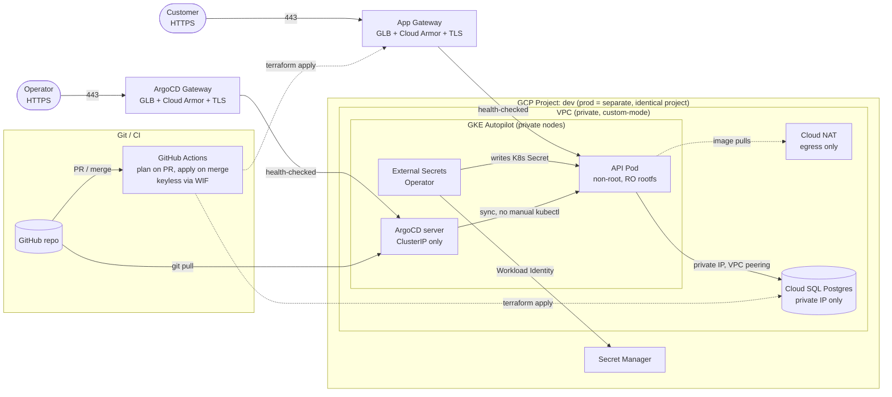

# Multi-Tenant Backend API Platform on GCP

> DevOps take-home assessment: onboard a new tenant's backend API onto a
> multi-tenant GCP platform. Secure internet access, a fully private
> database, Terraform-only infra, GitOps-only deploys, production security
> practices at dev cost.

**Live status**: `dev` and `prod` are both deployed and verified working
end to end (real GCP projects, real `terraform apply`, real ArgoCD sync).
See [Current status](#current-status).

---

## Assessment alignment checklist

| Requirement | Status | Where |
|---|---|---|
| Terraform modules | ✅ | `terraform/modules/` - 7 modules |
| ≥2 environments (dev/prod) | ✅ | `terraform/environments/{dev,prod}` |
| Remote state, GCS backend | ✅ | `versions.tf` in both envs; bucket from `terraform/bootstrap` |
| `terraform apply`, no manual console steps | ✅ | See [The one unavoidable exception](#the-one-unavoidable-exception) |
| Helm chart: Deployment/Service/Gateway/limits/probes/PDB | ✅ | `helm/api-service/templates/` (+ HPA, NetworkPolicy, ExternalSecret extras) |
| ArgoCD Application / App-of-Apps | ✅ | `argocd/{dev,prod}/` |
| GitHub Actions: plan on PR, apply on merge | ✅ | `.github/workflows/terraform.yaml` |
| README: architecture, bootstrap, GitOps flow, 6 design Qs | ✅ | this file |
| AI usage disclosure | ✅ | [AI usage](#ai-usage) |
| (Bonus) Actually deployed + evidence | ✅ | both `dev` and `prod` live, see [Current status](#current-status) |

### The one unavoidable exception

Every GCP resource *inside* a project is Terraform-managed. The one thing
outside Terraform's reach: **the GCP project + billing account existing in
the first place** - creating a new billing account needs a payment method
entered through Google's own UI; there's no Terraform resource for that.
Not a workaround, a hard platform limit. Registering a GitHub PAT for
ArgoCD/CI is the same category (GitHub has no API to mint one from a
script - UI-only, by design). Everything else - APIs, networking, GKE,
Cloud SQL, IAM, ArgoCD, ESO, Cloud Armor, certs - is `terraform apply`.

---

## Architecture



Graphviz source: [docs/architecture.dot](docs/architecture.dot).

**Every public endpoint - app and ArgoCD alike - sits behind its own
Gateway (GLB) with the same Cloud Armor policy.** Nothing gets a raw
`LoadBalancer` Service. `dev` and `prod` are separate GCP projects (own
IAM, quotas, billing, CI credentials) - not just separate namespaces.

| Layer | Choice |
|---|---|
| Project isolation | Separate GCP project per environment |
| Compute | GKE **Autopilot** |
| Database | Cloud SQL **PostgreSQL**, `ipv4_enabled = false` |
| Private DB path | **Private Service Access** (VPC peering) |
| Ingress | **GKE Gateway API** + Certificate Manager TLS |
| Edge security | **Cloud Armor** (rate limit + adaptive L7 DDoS) |
| Pod credentials | **Workload Identity** |
| Secrets | **Secret Manager** + **External Secrets Operator** |
| IaC | **Terraform**, modular, GCS backend, 2 projects |
| GitOps | **ArgoCD**, App-of-Apps, auto-sync + self-heal |
| CI | **GitHub Actions**, keyless (WIF) |
| Egress | **Cloud NAT** |

---

## Why these GCP services (pros/cons)

### Compute: GKE Autopilot vs Cloud Run vs GCE

| | GKE Autopilot ✅ chosen | Cloud Run | GCE |
|---|---|---|---|
| PodDisruptionBudget | ✅ native | ❌ no PDB concept | manual (instance groups) |
| Gateway API / shared ingress model | ✅ | partial (its own LB model) | build yourself |
| ArgoCD has something to reconcile against | ✅ full k8s API | ❌ no k8s API | ❌ no k8s API |
| Node management | ✅ none (Google-managed) | ✅ none | ❌ you patch/manage VMs |
| Security defaults | ✅ Workload Identity always on, Shielded Nodes, blocks privileged Pods | good, but less control over Pod-level policy | you build every hardening step |
| Billing | per-Pod request | per-request/idle-free | per-VM, always-on |
| **Verdict** | Best fit - the checklist explicitly wants PDB + Gateway + a real k8s API | Would've been simpler, but fails 3 hard requirements above | Works but pushes all patching/hardening onto us manually |

**Autopilot over Standard**: removes node-pool sizing decisions entirely,
and *hard-enforces* what this assessment asks for (Workload Identity
mandatory, Pod security admission blocks privileged/hostPath/dangerous
capabilities) - Standard's extra node-pool control isn't needed for one
small tenant and just adds ways to misconfigure security.

### Database: Cloud SQL vs self-managed Postgres on GKE

| | Cloud SQL ✅ chosen | Postgres on GKE (StatefulSet) |
|---|---|---|
| Private-only by construction | ✅ `ipv4_enabled=false`, no public IP ever exists | only if you build it right, no built-in guarantee |
| Backups / PITR | ✅ built-in | you own it (pg_dump, WAL archiving...) |
| HA failover | ✅ `REGIONAL` availability, one flag | you build Patroni/repmgr yourself |
| Ops burden | low | high - patching, failover testing, backup testing all on you |
| **Verdict** | Managed, and "private by construction, not by firewall rule" is a stronger security story than any self-managed setup |

### Networking: Private Service Access vs Cloud SQL Proxy sidecar

PSA (chosen) gives the Pod a plain private IP to connect to - no sidecar,
no extra container, no proxy process to keep alive. A Cloud SQL Auth
Proxy sidecar is the alternative (adds IAM-based short-lived certs on top
of the password), but adds a container to every Pod for marginal benefit
here since Workload Identity already removes key files everywhere else.

### GitOps: ArgoCD vs Flux

Both are valid; ArgoCD chosen for its UI (useful for a human-reviewed
demo/assessment), first-class App-of-Apps pattern, and per-Application
`syncPolicy` granularity (dev auto-prunes, prod doesn't - see
[design question 5](#5-gitops-what-happens-step-by-step-when-a-developer-merges-a-change-to-the-helm-chart-who-or-what-applies-it-to-the-cluster)).

---

## Repository layout

```
.
├── terraform/
│   ├── bootstrap/               # one-time: GCS state bucket (chicken-and-egg, run manually once per project)
│   ├── modules/
│   │   ├── network/            # VPC, subnet, Private Service Access, Cloud NAT, 1 firewall rule
│   │   ├── gke/                 # GKE Autopilot, private, Workload Identity, Gateway API
│   │   ├── database/            # Cloud SQL Postgres (private IP) + Secret Manager
│   │   ├── workload-identity/   # GCP SAs + IAM bindings (app + ESO)
│   │   ├── certificate/         # Certificate Manager - managed or self-signed
│   │   ├── security/            # Cloud Armor policy
│   │   └── argocd/              # ArgoCD via helm_release + its own Gateway chart
│   └── environments/{dev,prod}/ # wires modules together, env-specific sizing
├── helm/api-service/            # Deployment, Service, Gateway, HPA, PDB, NetworkPolicy, ExternalSecret
├── argocd/{dev,prod}/           # app-of-apps.yaml + apps/api.yaml, one ArgoCD instance per env
├── scripts/                     # setup/teardown/test automation - see below
├── .github/workflows/           # terraform.yaml (plan/apply) + bootstrap-environment.yaml (manual)
└── docs/architecture.dot
```

---

## Current status

| | dev | prod |
|---|---|---|
| Terraform applied | ✅ | ✅ |
| ArgoCD | ✅ `Synced`/`Healthy` | ✅ `Synced`/`Healthy` |
| App | ✅ 2 Pods `Running` | ✅ 3 Pods `Running` |
| DB connectivity verified | ✅ `scripts/test-db-connection.sh dev` | ✅ `scripts/test-db-connection.sh prod` |

---

## Bootstrap: from zero to running

1. **GCP project + billing** exist (manual, unavoidable - see above).
2. **Enable APIs** - handled automatically by Terraform (`google_project_service` in each environment), except the CI service account's own bootstrapping (see [CI/CD](#cicd)).
3. **State bucket**: `cd terraform/bootstrap && terraform apply -var="project_id=..." -var="bucket_name=..."` - once per project.
4. **Provision everything**: `cd terraform/environments/{dev,prod} && terraform apply` - creates VPC, GKE, Cloud SQL, Secret Manager, Cloud Armor, certs, **and installs ArgoCD + ESO** in the same apply. One command, one environment, fully stood up.
5. **Fill in the app's config + deploy it** - either:
   - **Local**: `./scripts/setup-dev.sh` / `./scripts/setup-prod.sh` (steps 1-9 below), or
   - **CI**: trigger `.github/workflows/bootstrap-environment.yaml` (`workflow_dispatch`, choose `dev`/`prod`) - does the same thing from GitHub Actions.
6. **Add `/etc/hosts` entries** - the only step that never gets automated (there's no real DNS domain in this assessment, hostnames are `*.tenant.internal` placeholders). Both the local scripts and the CI workflow print the two Gateway IPs at the end (CI: in the run's **Summary** tab):
   ```bash
   sudo tee -a /etc/hosts <<EOF
   <ARGOCD_GATEWAY_IP>  argocd-{env}.tenant.internal
   <APP_GATEWAY_IP>     api-{env}.tenant.internal
   EOF
   ```
   Or skip editing `/etc/hosts` entirely: `curl -k --resolve api-dev.tenant.internal:443:<IP> https://api-dev.tenant.internal/`.

What step 5 actually does (both local script and CI workflow, identical logic):
fetch `terraform output` → fill `values-{env}.yaml` placeholders → add a
placeholder third-party-secret version (only if empty) → commit + push →
apply `argocd/{env}/app-of-apps.yaml` (**the one and only manual
`kubectl apply` this environment ever needs**) → wait for ArgoCD to sync
→ print URLs.

---

## GitOps workflow, end to end

**A developer merges a Helm chart change to `main`:**

1. Merge lands on `main`. That's it from the developer's side - no `kubectl`, no `helm upgrade`.
2. ArgoCD (already running in-cluster) polls this repo (~3 min default, or on webhook) watching `path: helm/api-service`.
3. Sees the new commit → re-renders the chart with `values.yaml` + `values-{env}.yaml`.
4. Diffs the rendered manifests against live cluster state.
5. `syncPolicy.automated` + `selfHeal: true` → **ArgoCD applies the diff itself.**
6. dev: `prune: true` (deleted manifest → removed from cluster too). prod: `prune: false` (deleted manifest → untracked, not removed - see [design question 5](#5-gitops-what-happens-step-by-step-when-a-developer-merges-a-change-to-the-helm-chart-who-or-what-applies-it-to-the-cluster) for recovery).

**Who applies it to the cluster: ArgoCD, always. Never a human, never CI.**

**A developer merges a Terraform change to `main`:** goes through
`.github/workflows/terraform.yaml` instead - completely separate path,
see [CI/CD](#cicd) below. Terraform changes and Helm changes never share
a pipeline.

---

## CI/CD

### `terraform.yaml` - the graded requirement

Triggers (path-filtered to `terraform/**` only - Helm/ArgoCD changes never touch this workflow):

| Event | Jobs | What happens |
|---|---|---|
| PR touching `terraform/` | `plan-dev`, `plan-prod` | `terraform plan`, posted as a PR comment |
| Merge to `main` | `apply-dev`, then `apply-prod` | `terraform apply`; prod gated behind a required-reviewer approval |

Four explicit jobs, not one matrix - dev and prod are separate GCP
projects with separate credentials; a matrix shares config across
entries, these deliberately don't.

**Auth: keyless, via Workload Identity Federation.** GitHub's OIDC token
is exchanged for short-lived GCP credentials - no service account key
ever stored as a secret.

### `bootstrap-environment.yaml` - manual, one-time per environment

`workflow_dispatch` only (Actions tab → choose `dev`/`prod`). Does the
post-`apply` setup (see [Bootstrap](#bootstrap-from-zero-to-running) step 5)
via CI instead of your terminal. Kept **separate** from `terraform.yaml`
on purpose - some of its steps (adding the third-party secret's first
version) are unsafe to repeat on every merge; folding it into the routine
pipeline would silently overwrite a real key with a placeholder the
moment you'd set one. Reuses the same `dev`/`prod` GitHub Environments, so
`bootstrap-prod` gets the same reviewer gate. Never prints the ArgoCD
password (public repo → public logs); tells you the `kubectl` command to
fetch it yourself instead.

### GitHub Actions ↔ GCP setup (one-time, per project)

```bash
gcloud services enable iamcredentials.googleapis.com --project="$PROJECT_ID"

gcloud iam workload-identity-pools create "github-pool" --project="$PROJECT_ID" --location="global"
gcloud iam workload-identity-pools providers create-oidc "github-provider" \
  --project="$PROJECT_ID" --location="global" --workload-identity-pool="github-pool" \
  --issuer-uri="https://token.actions.githubusercontent.com" \
  --attribute-mapping="google.subject=assertion.sub,attribute.repository=assertion.repository" \
  --attribute-condition="assertion.repository=='ORG/REPO'"

gcloud iam service-accounts create "tenant-platform-ci-${ENV_NAME}" --project "$PROJECT_ID"

for role in roles/container.admin roles/compute.networkAdmin roles/cloudsql.admin \
            roles/secretmanager.admin roles/iam.serviceAccountAdmin \
            roles/iam.workloadIdentityPoolAdmin roles/resourcemanager.projectIamAdmin \
            roles/serviceusage.serviceUsageAdmin roles/certificatemanager.editor \
            roles/dns.admin roles/compute.securityAdmin; do
  gcloud projects add-iam-policy-binding "$PROJECT_ID" \
    --member="serviceAccount:tenant-platform-ci-${ENV_NAME}@${PROJECT_ID}.iam.gserviceaccount.com" --role="$role"
done

PROJECT_NUMBER="$(gcloud projects describe "$PROJECT_ID" --format='value(projectNumber)')"

# GKE Autopilot nodes use the default Compute Engine SA - creating the
# cluster attaches it, which needs serviceAccountUser on that specific SA.
gcloud iam service-accounts add-iam-policy-binding "${PROJECT_NUMBER}-compute@developer.gserviceaccount.com" \
  --project="$PROJECT_ID" --role="roles/iam.serviceAccountUser" \
  --member="serviceAccount:tenant-platform-ci-${ENV_NAME}@${PROJECT_ID}.iam.gserviceaccount.com"

gcloud storage buckets add-iam-policy-binding "gs://your-org-tenant-${ENV_NAME}-tfstate" \
  --member="serviceAccount:tenant-platform-ci-${ENV_NAME}@${PROJECT_ID}.iam.gserviceaccount.com" --role="roles/storage.objectAdmin"

gcloud iam service-accounts add-iam-policy-binding "tenant-platform-ci-${ENV_NAME}@${PROJECT_ID}.iam.gserviceaccount.com" \
  --role="roles/iam.workloadIdentityUser" \
  --member="principalSet://iam.googleapis.com/projects/${PROJECT_NUMBER}/locations/global/workloadIdentityPools/github-pool/attribute.repository/ORG/REPO"
```

Then set 4 GitHub Actions **Variables** (not Secrets - these are
identifiers): `DEV_WORKLOAD_IDENTITY_PROVIDER`, `DEV_CI_SERVICE_ACCOUNT`,
`PROD_WORKLOAD_IDENTITY_PROVIDER`, `PROD_CI_SERVICE_ACCOUNT`.

### All service accounts in this platform (8 total - 4 per environment)

| # | Service account | Created by | Used by | Purpose |
|---|---|---|---|---|
| 1 | `tenant-{env}-app-sa` | Terraform (`workload-identity` module) | App Pod, via Workload Identity | `roles/cloudsql.client` + `secretAccessor` on exactly 2 secrets |
| 2 | `tenant-{env}-eso-sa` | Terraform (`workload-identity` module) | External Secrets Operator, via Workload Identity | Reads the same 2 secrets, delivers them as a K8s Secret |
| 3 | `tenant-platform-ci-{env}` | Manual, one-time `gcloud` (see above) | GitHub Actions, via WIF | Runs `terraform apply`; scoped to the roles listed above, nothing project-wide beyond that |
| 4 | `{project_number}-compute@developer.gserviceaccount.com` | GCP (pre-existing default) | GKE Autopilot nodes | Node identity - CI's SA needs `serviceAccountUser` on it to create the cluster |

No service account key files exist anywhere in this platform - #1/#2 use
Workload Identity (KSA → GSA impersonation), #3 uses Workload Identity
Federation (GitHub OIDC → GSA impersonation), #4 is never directly
impersonated by anything we run.

---

## Networking & DB connectivity

**Pod → Cloud SQL, hop by hop:**

1. API Pod gets an IP from the GKE cluster's **Pods secondary range** (VPC-native/alias-IP, required by Autopilot).
2. Egress checked against the Pod's own **NetworkPolicy** first: only DNS, the exact Cloud SQL IP/port, and HTTPS:443 are allowed - default-deny everything else (GKE Autopilot always runs Dataplane V2/Cilium, so this enforces with zero extra setup).
3. Routes through **Private Service Access** (`google_service_networking_connection`, backed by a reserved `google_compute_global_address` range) - a VPC peering to Google's service-producer network.
4. Arrives at **Cloud SQL's private IP**, which lives inside that peered range, not in any subnet of our own VPC.
5. `ssl_mode = ENCRYPTED_ONLY` requires TLS on top.

**Traffic never touches the public internet** - no firewall rule makes
this private, the instance simply has no public IP to route to.

### Firewall rules

**Exactly one**, in the whole platform: allow ingress from Google Front
End's two well-known ranges (`130.211.0.0/22`, `35.191.0.0/16`) on the
backend port only (8080). Everything else is implicit-deny (custom-mode
VPC, no inherited "default" network rules). This is deliberately minimal -
it's the LB-to-Pod health-check path, nothing broader.

### Cloud Armor

Attached to every backend (app + ArgoCD) via `GCPBackendPolicy`. Current
rules: **adaptive Layer-7 DDoS defense + per-IP rate limiting** only - no
WAF signature rules right now (see below for why), but the policy
resource itself is already wired to both backends, so adding scoped rules
later is a Terraform-only change, not a re-architecture.

**Why no WAF rules yet**: Google's preconfigured `sqli-stable`/`xss-stable`
rulesets were tried and pulled after they blocked ArgoCD's own login
redirect (`?return_url=https%3A%2F%2F...` - a URL-encoded absolute URL in
a query param is a textbook false-positive trigger). Re-adding them
correctly means scoping `preconfiguredWafConfig` exclusions to the
specific paths/params that legitimately carry redirect-style URLs,
validated in `preview: true` against real traffic first - not a blanket
rule applied blind, which is what broke last time.

### How ESO, Gateway, and ArgoCD get installed

All three are installed **by Terraform**, in the same `apply` that
creates the cluster - no separate manual install step, ever:

- **ArgoCD**: `helm_release` (upstream `argo-helm` chart), `server.service.type=ClusterIP` + `--insecure` (TLS terminates at the Gateway, not at ArgoCD itself).
- **ArgoCD's Gateway/HTTPRoute/GCPBackendPolicy**: a tiny local Helm chart (`terraform/modules/argocd/chart`), installed via `helm_release` too - raw `kubernetes_manifest` resources need a live, reachable cluster at *plan* time, which breaks on a from-scratch apply where the cluster is created in that same run.
- **External Secrets Operator**: `helm_release` (upstream chart), its controller ServiceAccount annotated for Workload Identity at install time - no follow-up `kubectl annotate`.
- **The app's own Gateway**: part of the Helm chart (`helm/api-service/templates/gateway.yaml`), deployed by ArgoCD like everything else app-related.

---

## Secrets & credentials

- **DB password**: `random_password` → written straight to Secret Manager → **never appears in any Terraform output, plan, or log**. Only the secret's *name* is a Terraform output.
- **Third-party API key**: Terraform creates the empty secret *container* only; the value is added out-of-band (`gcloud secrets versions add`) - never passes through git, CI logs, or Terraform state.
- **Delivery**: each tenant's Helm release ships its own namespaced `SecretStore` (not one shared `ClusterSecretStore`), authenticating via `workloadIdentity` against that tenant's own KSA. ESO is a shared, cluster-wide controller, but it never holds broad access itself - each `SecretStore` can only read its own tenant's secrets.
- **Refresh**: `ExternalSecret` → plain K8s `Secret`, `refreshInterval: 1m`, consumed via `envFrom`.
- **In git**: secret names/IDs, IAM bindings, `SecretStore`/`ExternalSecret` manifests. **Never in git**: the DB password, the API key value, any service account key file (there isn't one).

---

## Testing the private DB connection

```bash
gcloud container clusters get-credentials tenant-{dev,prod}-gke --region us-central1 --project knotch-{dev,prod}
./scripts/test-db-connection.sh dev
# or: ENV=dev ./scripts/test-db-connection.sh
```

Runs as an **ephemeral debug container attached to a real, running app
Pod** (`kubectl debug`, not `kubectl run`) - so the test rides that Pod's
actual network namespace and is genuinely subject to its own
`NetworkPolicy` egress rule, not bypassing it via an unselected bystander
Pod. Two checks:

1. `pg_isready` - TCP reachability through the NetworkPolicy egress rule.
2. `psql -c "SELECT 1"` - authenticated query with the real ESO-delivered credentials.

Runs as root inside that one throwaway container only (`postgres:16-alpine`'s
client tools abort on an arbitrary UID with no `/etc/passwd` entry) - never
touches the real app container's security posture. Ephemeral containers
can't be removed once attached (harmless, terminated, zero cost - clears
on the Pod's next rollout).

Confirmed passing against both live environments.

---

## Automation scripts

All five in `scripts/`, `chmod +x` already, no dependencies beyond
`terraform`/`kubectl`/`gcloud`/`git`. Every destructive step prints an
`IMPACT:` block and requires typing `y` first; every step is idempotent.

| Script | Purpose |
|---|---|
| `setup-dev.sh` / `setup-prod.sh` | Full provision: `terraform apply` → fill Helm values → deploy via ArgoCD → print URLs |
| `test-db-connection.sh <dev\|prod>` | Prove the private DB path works (see above) |
| `teardown-dev.sh` / `teardown-prod.sh` | `terraform destroy` or delete-the-whole-project, interactively chosen |

**Teardown specifics**: `teardown-prod.sh` has to flip
`deletion_protection`/`prevent_destroy` off (GKE, Cloud SQL, third-party
secret), `apply`, destroy, then flip back - `teardown-dev.sh` has no such
flags to handle. Both require typing the **exact project ID** back, not
just `y`, since this is irreversible. The VPC/subnet/PSA-range/DB-password
secret are **not** hard-locked (they're in modules shared with dev, and
Terraform's `prevent_destroy` can't be parameterized by a variable) -
covered by the same project-ID confirmation prompt instead.

---

## Security, scalability, cost

### Security - ranking: strong for a dev-cost setup, production-equivalent posture

- No public IPs anywhere except the two Gateways (app, ArgoCD) - not even the GKE control plane's node-facing side.
- Zero service account key files (Workload Identity + WIF everywhere).
- Least-privilege IAM: app SA gets exactly `cloudsql.client` + 2 named `secretAccessor` bindings, not project-wide roles.
- Pod security: non-root, `readOnlyRootFilesystem`, all capabilities dropped, `allowPrivilegeEscalation: false`, seccomp `RuntimeDefault` - enforced by Autopilot's own admission control, not just convention.
- Defense in depth on ingress: Cloud Armor (edge) → NetworkPolicy (Pod) → exact-port firewall rule (VPC) - three independent layers, not one.
- **Gap, acknowledged**: no WAF signature rules yet (see [Cloud Armor](#cloud-armor) above) - the policy is wired for it, rules aren't tuned in yet.

### Scalability - ranking: solid for a demo tenant, standard patterns for growth

- HPA on CPU + memory, asymmetric scale-up/down (fast up, slow down) to avoid flapping.
- `topologySpreadConstraints` spreads Pods across zones.
- PodDisruptionBudget guarantees availability during Autopilot's frequent node upgrades.
- Autopilot itself scales node capacity to match Pod demand - no cluster-autoscaler tuning needed.
- **Not yet exercised**: real load testing against the HPA thresholds - values are reasonable defaults, not load-tested.

### Cost - ranking: dev is materially cheaper, same security posture as prod

| Setting | dev | prod |
|---|---|---|
| Compute billing | Autopilot per-Pod-request (no idle nodes) | same |
| DB tier | `db-f1-micro` | `db-custom-2-7680` |
| DB availability | `ZONAL` | `REGIONAL` (HA) |
| Point-in-time recovery | off | on |
| Deletion protection | off | on |
| HPA range | 2-4 | 3-10 |
| Cloud Armor rate limit | 200 req/min/IP | 100 req/min/IP |
| Certificate mode | `self_signed` | `managed` (once a real domain exists) |
| ArgoCD `prune` | `true` | `false` |

**Every lever above is capacity/availability, never security** - both
environments get identical Workload Identity, NetworkPolicy, Cloud Armor,
and IAM scoping.

---

## Tear it down

**Fast path**: `./scripts/teardown-dev.sh` / `./scripts/teardown-prod.sh` (see [Automation scripts](#automation-scripts)).

**Manual**: `cd terraform/environments/{dev,prod} && terraform destroy` -
or `gcloud projects delete <project-id>` for a full wipe (~30-day
recovery window via `gcloud projects undelete`). Destroy environments
*before* the bootstrap stack - an environment's state lives inside the
bucket bootstrap created.

---

## Adding a new environment

1. **New GCP project + state bucket**: `cd terraform/bootstrap && terraform apply -var="project_id=..." -var="bucket_name=..." -state="staging.tfstate"`.
2. **Copy an environment**: `cp -r terraform/environments/prod terraform/environments/staging`.
3. **Edit** `versions.tf` (new bucket) and `terraform.tfvars` (`project_id`, CIDR ranges, `hostname`, `certificate_mode`, `third_party_api_key_secret_id`, etc. - full list was already validated against dev/prod's actual variables).
4. **Copy ArgoCD manifests**: `cp -r argocd/dev argocd/staging`, update `path`/namespace/Application name.
5. **Copy Helm values**: `cp helm/api-service/values-prod.yaml helm/api-service/values-staging.yaml`, adjust sizing.
6. **Copy scripts**: `cp scripts/setup-prod.sh scripts/setup-staging.sh` (+ teardown), update the config block.
7. **Run**: `./scripts/setup-staging.sh`.

---

## Design questions

### 1. Compute: Which GCP compute service did you choose (GKE, Cloud Run, GCE) and why? If GKE - Standard or Autopilot, and why?

**GKE Autopilot.** See [Why these GCP services](#compute-gke-autopilot-vs-cloud-run-vs-gce) above for the full pros/cons - short version: Cloud Run and GCE each fail a hard requirement (no PDB concept; no k8s API for ArgoCD to reconcile against, respectively). Autopilot over Standard because it hard-enforces Workload Identity/Shielded Nodes/no-privileged-Pods and removes node-pool sizing decisions entirely - not needed for one small tenant.

### 2. Database connectivity: How does the API service connect to the database privately? Walk through the network path from pod to database.

See [Networking & DB connectivity](#networking--db-connectivity) above -
full hop-by-hop path: Pod → NetworkPolicy egress check → Private Service
Access peering → Cloud SQL private IP, entirely inside Google's network,
never touching the public internet. No firewall rule makes this private -
the instance has no public IP to route to in the first place.

### 3. Credentials: How does the application authenticate to GCP services (database, Secret Manager, etc.) without a service account key file?

**Workload Identity.** The app's KSA is annotated with the GCP SA's email;
GKE's metadata server issues a short-lived OIDC token, exchanged
automatically for temporary GSA credentials because of an
`iam.workloadIdentityUser` binding scoped to exactly that
namespace/KSA pair. No key ever exists to leak or rotate. CI uses the
same pattern in spirit (Workload Identity Federation) for GitHub Actions
- see [Service accounts](#all-service-accounts-in-this-platform-8-total---4-per-environment) above for the full list of identities and what each does.

### 4. Secrets: How are secrets (e.g. third-party API keys) managed and delivered to the application? What lives in git vs what doesn't?

See [Secrets & credentials](#secrets--credentials) above. Secret Manager
holds values, External Secrets Operator delivers them, per-tenant
`SecretStore`s keep tenants isolated from each other. In git: names/IDs
and manifests. Never in git: the actual password/key values.

### 5. GitOps: What happens step-by-step when a developer merges a change to the Helm chart? Who or what applies it to the cluster?

See [GitOps workflow, end to end](#gitops-workflow-end-to-end) above.
**ArgoCD applies it - always, never a human, never CI.** One nuance worth
calling out: prod's `prune: false` means a manifest *deleted* from git
doesn't get deleted from the live cluster automatically - it just goes
untracked, until someone explicitly runs `argocd app sync --prune`. This
is a deliberate safety net (a stray `git rm` in prod can't silently delete
a live resource), not an oversight.

### 6. Cost: What choices did you make to keep the dev environment affordable while keeping the architecture production-equivalent?

See [Cost](#cost---ranking-dev-is-materially-cheaper-same-security-posture-as-prod)
above for the full dev-vs-prod table. Every lever (DB tier/availability,
PITR, deletion protection, HPA range, rate limits) is a
capacity/availability knob - **security posture is identical** in both
environments (same Workload Identity, same NetworkPolicy, same Cloud
Armor, same IAM scoping).

---

## AI usage

Built with Claude Code as a pair-programming accelerator, from the
architecture decisions recorded in `CLAUDE.md`.

- **Prompted for**: Terraform module/environment scaffolding, Helm chart
  templates, ArgoCD manifests, GitHub Actions workflows, this README.
- **Accepted as-is**: boilerplate (Helm `_helpers.tpl`, variable/output
  plumbing, `.gitignore`) - well-known conventions, little judgment
  needed.
- **Verified against GCP/K8s docs, not trusted blind**: Private Service
  Access requirements, GKE Gateway API's Certificate Manager TLS model,
  ESO's `workloadIdentity` auth flow, the per-tenant `SecretStore` design
  (a deliberate multi-tenancy call, not a default).
- **Real bugs the model introduced, caught only by applying against live
  GCP projects** (not caught by `terraform validate`, which doesn't hit
  the GCP API): an invalid `ssl_mode` enum value; two resources missing
  `depends_on` on API enablement; `google_project_iam_member` needing
  `cloudresourcemanager.googleapis.com`, missed until CI's least-privilege
  identity (not a personal Owner account) actually needed it;
  `iamcredentials.googleapis.com` needed for WIF auth itself on a
  never-before-applied project; a Compute Engine default SA
  `serviceAccountUser` grant needed for GKE cluster creation; and an
  `actions/checkout`/`auth` step-ordering bug in a new workflow that
  silently deleted its own WIF credentials file.
- **Found and fixed against real traffic, not local validation**: Cloud
  Armor's preconfigured WAF rulesets blocked ArgoCD's own login redirect
  (diagnosed via browser DevTools + `curl` + Cloud Armor logs) - rulesets
  removed, root cause and correct fix documented in
  [Cloud Armor](#cloud-armor) above.
- **Validated locally**: `terraform fmt`/`validate` clean across all
  three stacks; `helm lint`/`helm template` clean for both value files;
  `scripts/test-db-connection.sh` run and passing against both live
  environments.
- **Who ran what**: the assistant executed a substantial number of
  `gcloud`/`kubectl`/`terraform` commands directly against the live
  `knotch-dev` and `knotch-prod` projects during this build (with the
  repo owner present and confirming destructive/impactful steps) -
  including the original applies, live debugging, and the DB connectivity
  tests. Prod's very first `terraform apply` was explicitly run by the
  repo owner themselves, by request.

---

## Placeholders to replace before pushing

- `REPLACE_WITH_{DEV,PROD}_TF_STATE_BUCKET` - `terraform/environments/{dev,prod}/versions.tf`
- `REPLACE_WITH_{DEV,PROD}_GCP_PROJECT_ID` - each `terraform.tfvars` (must be two different project IDs)
- `REPLACE_WITH_GCP_PROJECT_ID` - each Helm `values-*.yaml`
- `REPLACE_ORG/REPLACE_REPO` - `argocd/{dev,prod}/*.yaml`
- `hostname`/`argocd_hostname` in `terraform.tfvars` + Helm `gateway.hostname` (prod only - dev already has working no-domain placeholders)
- `REPLACE_WITH_TERRAFORM_OUTPUT_*` - Helm values, filled from `terraform output` (or automatically by the setup scripts/CI workflow)
- `DEV_/PROD_WORKLOAD_IDENTITY_PROVIDER`/`CI_SERVICE_ACCOUNT` - GitHub Actions Variables

## Definition of done

- [x] `terraform fmt -check`/`validate` clean (bootstrap + both envs, 7 modules)
- [x] `helm lint`/`helm template` clean for both value files
- [x] All required Helm objects present + HPA/NetworkPolicy/ExternalSecret/GCPBackendPolicy extras
- [x] ArgoCD app-of-apps + child app per environment, installed by Terraform
- [x] GitHub Actions: plan on PR, apply on merge, keyless via WIF
- [x] `terraform apply` alone provisions the whole environment incl. ArgoCD/ESO/certs
- [x] Works with no real domain (`self_signed` mode)
- [x] Every public endpoint behind a Gateway + Cloud Armor, nothing raw `LoadBalancer`
- [x] dev/prod fully separate GCP projects
- [x] State bucket hardened (`public_access_prevention`, lifecycle cleanup)
- [x] Firewall + NetworkPolicy scoped to exact ports/destinations
- [x] Private DB connectivity verified live, not just asserted
- [x] README: diagram, bootstrap, GitOps flow, all 6 design answers, AI-usage section
- [x] Placeholders replaced, repo pushed to GitHub
- [x] (Bonus) **Both dev and prod** deployed to real GCP projects end to end, verified reachable
